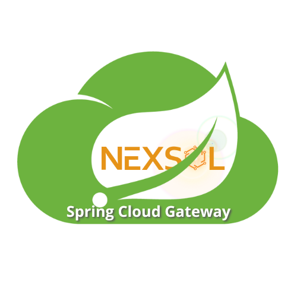

  
   
  <em>Plugins for Spring Cloud Gateway.</em>
   

 

 

# Spring Cloud Gateway plugins by [neXsol technologies](https://nexsol.tech)

## Getting Started

[spring-cloud-gateway-database](spring-cloud-gateway-database/README.md)  
This plugin enables database-driven route management in Spring Cloud Gateway and includes a simple GUI for adding, updating, and deleting routes.

[spring-cloud-gateway-filters](spring-cloud-gateway-filters/README.md) 
This plugin provides various custom filters for Spring Cloud Gateway, including Authorization, AuthorizationToken, ConvertHttpMethod, and Recaptcha.

[spring-cloud-gateway-oauth2](spring-cloud-gateway-oauth2/README.md) 
This plugin adds OAuth2 support to Spring Cloud Gateway, making it easier to implement multi-tenant OAuth2 authentication and JWT validation.

[spring-cloud-gateway-openapi](spring-cloud-gateway-openapi/README.md) 
This plugin provides openapi support for Spring Cloud Gateway

## samples

[spring-cloud-gateway-samples](spring-cloud-gateway-samples/README.md)
This projet provides some examples.

## Spring Cloud Gateway documentation

[reference documentation](https://docs.spring.io/spring-cloud-gateway/docs/current/reference/html/)

## Getting Help

Having trouble with Spring cloud Gateway plugins by Nexsol? We’d like to help!

 * Report bugs at https://github.com/nexsol-technologies/spring-cloud-gateway-plugins/issues
 
## Trademarks and licenses
The source code of nexsol's Spring cloud Gateway is licensed under [Apache License 2.0](https://www.apache.org/licenses/LICENSE-2.0)

Spring, Spring Boot and Spring Cloud are trademarks of [Pivotal Software, Inc.](https://pivotal.io/) in the U.S. and other countries.
