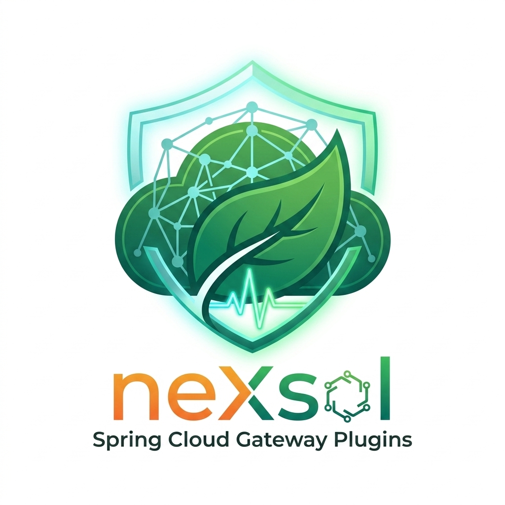

  
   
  <em>Plugins for Spring Cloud Gateway.</em>
   

# Spring Cloud Gateway plugins by [neXsol technologies](https://nexsol.tech)

## Plugins

[spring-cloud-gateway-audit](spring-cloud-gateway-audit/README.md) 
Audits gateway requests and responses (JWT, request, response and trace attributes, toggled by logical group) and pushes them to a pluggable provider (Redis, Kafka, database, ...). Auditing runs per route (the `Audit` gateway filter) or globally (a web filter).

[spring-cloud-gateway-metrics](spring-cloud-gateway-metrics/README.md) 
Collects the figures the UI plots, from a pluggable source: the per-route request figures the traffic view charts, and the per-instance technical figures the instances view lists (memory, processor, threads, and the connection pools towards the downstream services). The default reads the meter registry of the running instance; behind a load balancer that is only its own share, so a provider consolidates every instance instead (Prometheus, Redis, or the service registry). Every figure is reported with the coverage it was computed over.

[spring-cloud-gateway-routes](spring-cloud-gateway-routes/README.md) 
Manages gateway route definitions from pluggable sources aggregated into a route locator: a database (with a management GUI), JSON/YAML files (GitOps friendly), a Config Server and OpenAPI contracts.

[spring-cloud-gateway-filters](spring-cloud-gateway-filters/README.md) 
Custom gateway filters: `Authorization`, `ConvertHttpMethod`, `CorrelationId` and `Recaptcha`.

[spring-cloud-gateway-oauth2](spring-cloud-gateway-oauth2/README.md) 
OAuth2 support for Spring Cloud Gateway: multi-tenant authentication, JWT validation, and the `AuthorizationToken` filter validating an access token per route.

[spring-cloud-gateway-hub-openapi](spring-cloud-gateway-hub-openapi/README.md) 
Aggregates the OpenAPI documentation of downstream services into a hub. To generate routes from an OpenAPI contract instead, see [spring-cloud-gateway-routes-openapi](spring-cloud-gateway-routes/spring-cloud-gateway-routes-openapi/README.md).

[spring-cloud-gateway-openapi-validation](spring-cloud-gateway-openapi-validation/README.md) 
Validates the requests and the responses of a route against an OpenAPI contract (the `OpenapiValidation` filter), so the contract becomes something the gateway enforces rather than documentation. Each direction is configured on its own — a request denied with `400` while the responses of the same route are only reported on — and every outcome is counted in Micrometer and stamped on the audit trail. A body is only ever buffered when it is JSON, uncompressed and within a configured maximum, so a file upload streams straight through.

[spring-cloud-gateway-ui](spring-cloud-gateway-ui/README.md) 
A Spring Boot Admin-like web UI served under `/ui`, where each gateway plugin lights up its own view automatically when present on the classpath: an overview home page, the resolved routes with the source each one came from, a route tester answering which route would handle a described request (and why, predicate by predicate), a traffic chart, the technical health of every running instance and a live tail of the audit events. It is also where the HTTP endpoints of the other plugins are governed: they follow the console when it is behind a login, and stay open when it is not.

[spring-cloud-gateway-commons](spring-cloud-gateway-commons/README.md) 
The contracts the plugins share: how a plugin declares the paths it serves, so the console above can decide who reaches them without either side depending on the other, and how the running instance is named, so two plugins can label their figures with the same pod without depending on each other.

## Samples

[spring-cloud-gateway-samples](spring-cloud-gateway-samples/README.md) — one runnable gateway per plugin, plus a few exercising them in combination.

## Tools

[tools](tools/README.md) — scripts for the maintenance of this repository, such as
re-capturing the screenshots of the console the READMEs embed.

## Spring Cloud Gateway documentation

[Reference documentation](https://docs.spring.io/spring-cloud-gateway/reference/)

## Getting help

Report bugs and ask questions at
https://github.com/nexsol-technologies/spring-cloud-gateway-plugins/issues

## Trademarks and licenses

The source code of neXsol's Spring Cloud Gateway plugins is licensed under the [Apache License 2.0](https://www.apache.org/licenses/LICENSE-2.0).

Spring, Spring Boot and Spring Cloud are trademarks of [Broadcom Inc.](https://www.broadcom.com/) and/or its subsidiaries in the U.S. and other countries.
