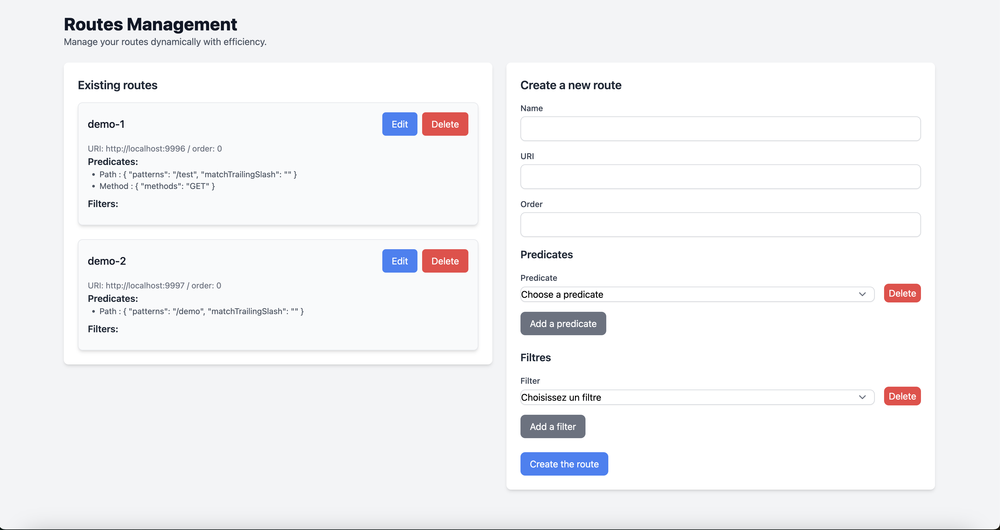

# spring-cloud-gateway-database

This project provides a database management for routes for Spring Cloud Gateway

```xml
    <dependencies>
        <dependency>
           <groupId>ch.nexsol.gateway</groupId>
           <artifactId>spring-cloud-gateway-database</artifactId>
           <version>${spring-cloud-gateway-plugins.version}</version>
        </dependency>
    </dependencies>
```

## Light GUI

<p align="center">
  
  <br>
  <em>Manage routes saved in database.</em>
  <br>
</p>

## API Gateway Routes Management

This project provides an API for managing gateway routes in a reactive environment using **Spring WebFlux**.

### Features

- Dynamic Route Management: Supports CRUD operations on routes. <br>
- Predicate & Filter Support: Routes can be defined with predicates (conditions to match requests) and filters (modifications to requests/responses).
