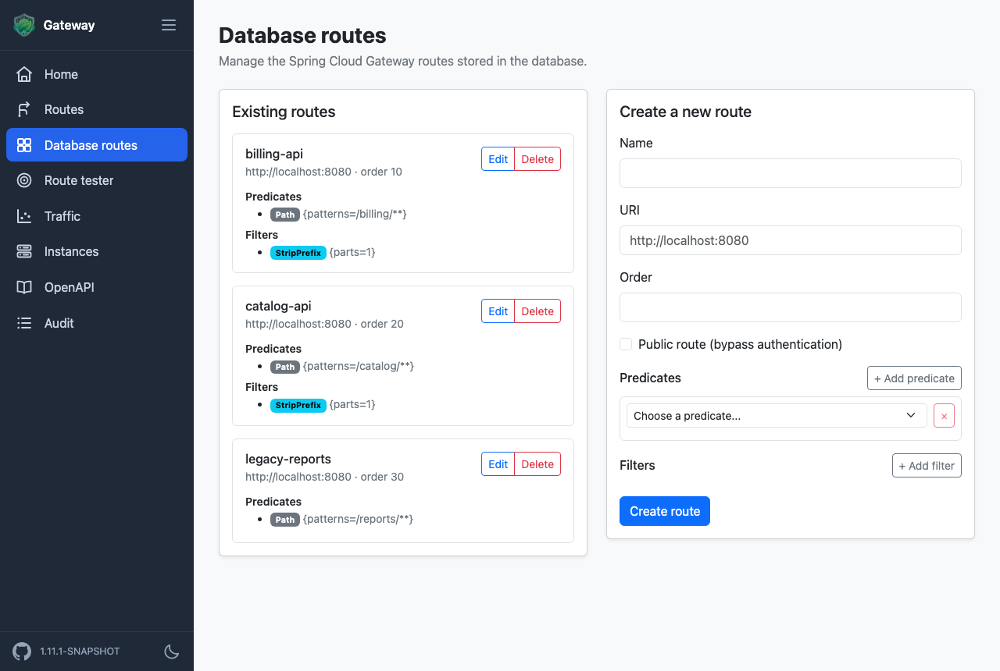

# spring-cloud-gateway-routes-database

Stores Spring Cloud Gateway route definitions in a relational database (R2DBC) and aggregates
them into the route locator. Routes are managed through a REST API and a bundled management UI.

```xml
    <dependencies>
        <dependency>
           <groupId>ch.nexsol-tech.gateway</groupId>
           <artifactId>spring-cloud-gateway-routes-database</artifactId>
           <version>${spring-cloud-gateway-plugins.version}</version>
        </dependency>
    </dependencies>
```

## Management UI

The plugin bundles a server-rendered management page, hosted inside the gateway UI shell at
`/ui/routes/db`. It requires the `spring-cloud-gateway-ui` plugin: when that shell is present
the page activates and appears as the **Database routes** entry in the shared side menu;
without it the plugin exposes its REST API only.



The page is rendered with Thymeleaf and driven by HTMX, against the same REST endpoints
described below. From `/ui/routes/db` you can:

- list existing routes with their predicates and filters;
- create and edit routes, dynamically adding predicates and filters;
- pick a predicate or a filter and have its accepted arguments loaded on the fly;
- delete routes.

The page and its HTMX fragments are exposed by `RouteViewController` under `/ui/routes/db`, while
the JSON REST API stays available under `/api/gateway/routes`.

## REST API

A reactive (Spring WebFlux) API for managing the stored routes, under `/api/gateway/routes`:

- **CRUD on routes** — create, read, update and delete route definitions at runtime.
- **Predicates and filters** — a route carries its predicates (the conditions matching a
  request) and its filters (the modifications applied to the request and the response), in the
  same form the gateway configuration uses.
