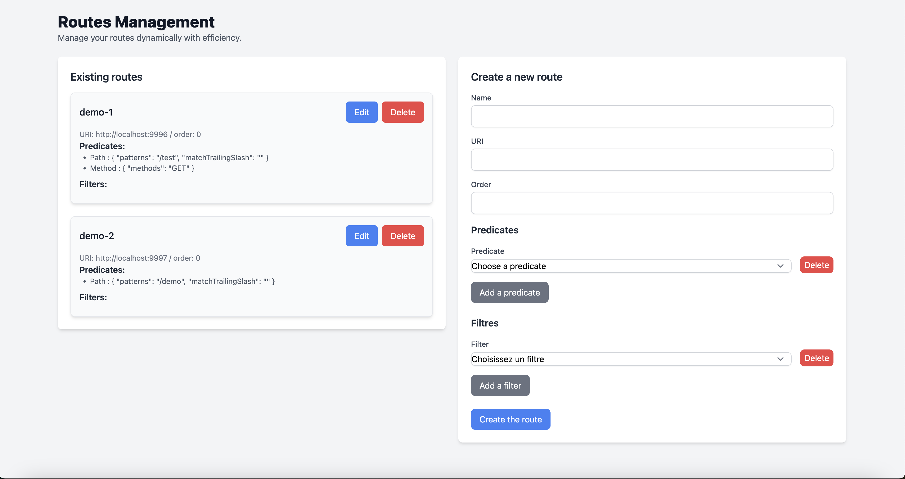

# spring-cloud-gateway-routes-database

This project provides a database management for routes for Spring Cloud Gateway

```xml
    <dependencies>
        <dependency>
           <groupId>ch.nexsol-tech.gateway</groupId>
           <artifactId>spring-cloud-gateway-routes-database</artifactId>
           <version>${spring-cloud-gateway-plugins.version}</version>
        </dependency>
    </dependencies>
```

## Light GUI

A server-rendered management UI is bundled with the plugin and served at `/ui`.
It is built with **Thymeleaf**, **Bootstrap 5** and **HTMX** (no build step, assets
vendored under `static/`) and drives the same REST endpoints described below.

<p align="center">
  
  <br>
  <em>Manage routes saved in database from <code>/ui</code>.</em>
  <br>
</p>

From `/ui` you can:

- list existing routes with their predicates and filters;
- create and edit routes, dynamically adding predicates and filters;
- pick a predicate/filter and have its accepted arguments loaded on the fly (HTMX);
- delete routes.

The page and its HTMX fragments are exposed by `RouteViewController` under `/ui`, while
the JSON REST API stays available under `/api/gateway/routes`.

## API Gateway Routes Management

This project provides an API for managing gateway routes in a reactive environment using **Spring WebFlux**.

### Features

- Dynamic Route Management: Supports CRUD operations on routes. <br>
- Predicate & Filter Support: Routes can be defined with predicates (conditions to match requests) and filters (modifications to requests/responses).
