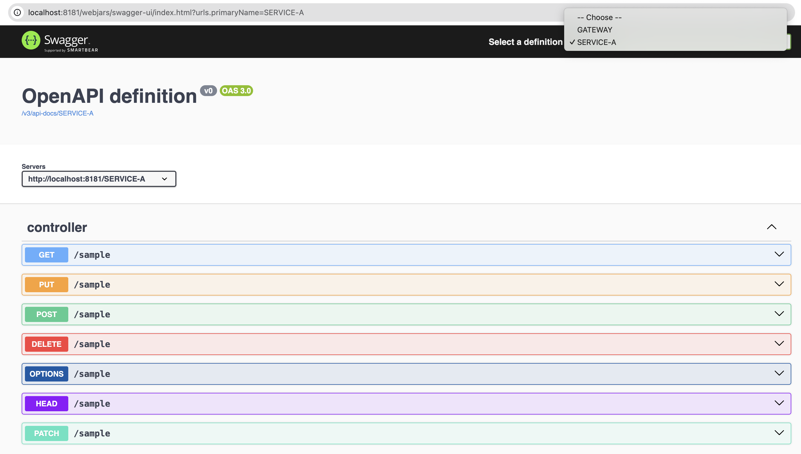

# spring-cloud-gateway-samples

## Getting start

### auth-server
Launch auth-server: this will start an easy config of oauth2 authorization server. 
To log-in, use these two user:password : `user:user` with role 'USER'  or `admin:admin` with role 'ADMIN'

### eureka
Launch Eureka service discovery to test SCGateway Openapi discovery with service-a.

### service-a
Launch service-a: this will start a simple app with a controller.

### config-server
Launch config-server: a Spring Cloud Config Server (port `8888`) serving gateway route files from
a native classpath repository (`config-repo/orders-routes.yaml`, `config-repo/billing-routes.yaml`).
Check a served file with:
`curl http://localhost:8888/gateway/default/main/orders-routes.yaml`

### gateway
Launch gateway. 

#### spring-cloud-gateway-filters
In the application.yml some routes are configured to test the filters provided by the plugin

| Url | Description |
| --- | --- |
| http://localhost:8181/test-authorization/sample | the validation of a basic authentification |
| http://localhost:8181/test-authorization-token/sample | the validation of jwt with 'user:user' is successful |
| http://localhost:8181/test-authorization-token-ko/sample | the validation of jwt with 'user:user' is failed |

#### spring-cloud-gateway-hub-openapi
<i>For the demo, you need to run the gateway and service-a with the profile "eureka".</i>
 
To test, go to http://localhost:8181/swagger-ui.html and you should have access to swagger interface with SERVICE-A api's:

  

#### spring-cloud-gateway-ui

The sample bundles the `spring-cloud-gateway-ui` shell. Go to http://localhost:8181/ui for
the home page and its collapsible side menu. Because the routes-database plugin is on the
classpath, a **Database routes** entry lights up automatically and leads to the management UI.

#### spring-cloud-gateway-routes-configserver
<i>For the demo, run the `config-server` sample first, then start the gateway with the `configserver` profile:</i>
 
`mvn spring-boot:run -Dspring-boot.run.profiles=configserver` (from the `gateway` module).
 
The gateway loads its route files from the Config Server (via
[`application-configserver.yml`](gateway/src/main/resources/application-configserver.yml)) and exposes:

| Url | Description |
| --- | --- |
| http://localhost:8181/cs-orders/get | route `configserver_orders_route` → httpbin.org |
| http://localhost:8181/cs-billing/get | route `configserver_billing_route` → httpbin.org |

Change a file in `config-server/.../config-repo/` and hit `POST http://localhost:8181/actuator/refresh`
(or wait for `update-interval`) to reload the routes without restarting the gateway.

#### spring-cloud-gateway-routes-database

To test, go to http://localhost:8181/ui/routes/db (or open it from the **Database routes** menu entry)
and you should have access to the gui to manage routes:

  

