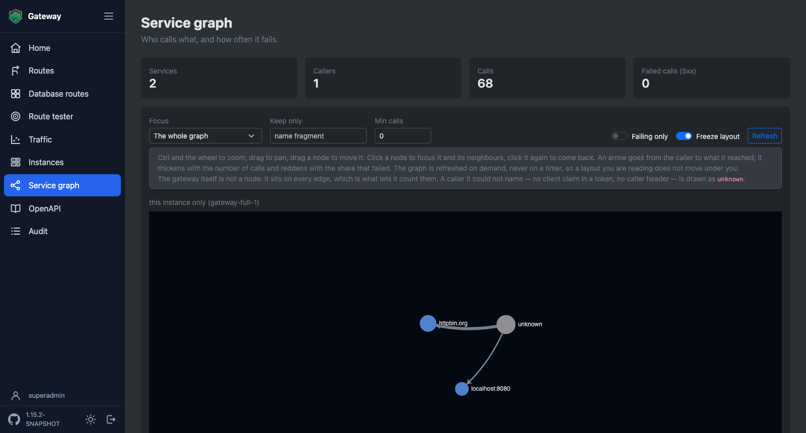
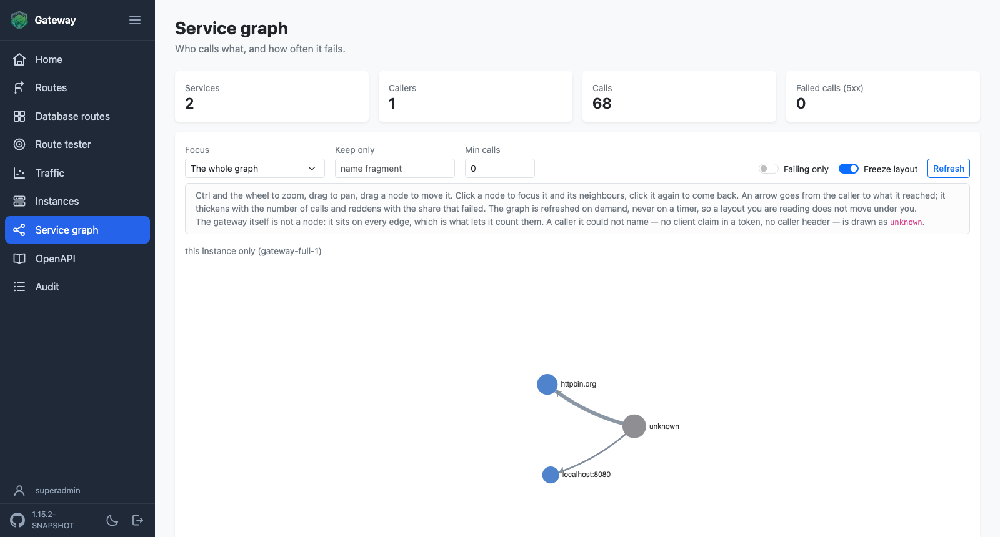

# spring-cloud-gateway-ui

A Spring Boot Admin-like web console for Spring Cloud Gateway, served under `/ui`. Each
plugin lights up its own view automatically when it is present on the classpath, and this is
also where the HTTP endpoints of the other plugins are governed.


Built with Thymeleaf, Bootstrap, HTMX and plain CSS/JS, served as static resources — no CDN,
offline friendly.

## Install

```xml
<dependency>
    <groupId>ch.nexsol-tech.gateway</groupId>
    <artifactId>spring-cloud-gateway-ui</artifactId>
    <version>${spring-cloud-gateway-plugins.version}</version>
</dependency>
```

Nothing else to set up: start the gateway and open `http://<host>:<port>/ui`.

## The views

Each one activates on its own, from what is on the classpath, so the console only ever shows
what the application actually runs.

| View | Path | Activates when |
| --- | --- | --- |
| [Home](#home) | `/ui` | always |
| [Routes](#routes) | `/ui/routes` | the gateway route definition types are present |
| [Database routes](#database-routes-view) | `/ui/routes/db` | `spring-cloud-gateway-routes-database` is present |
| [Route tester](#route-tester) | `/ui/routes/test` | the gateway route table type is present |
| [Traffic](#traffic) | `/ui/metrics` | Micrometer is present |
| [Instances](#instances) | `/ui/metrics/instances` | Micrometer is present and `...metrics.instance.enabled` is not `false` |
| [Service graph](#service-graph) | `/ui/service-graph` | `spring-cloud-gateway-service-graph-core` is present |
| [OpenAPI](#openapi) | `/ui/openapi` | `spring-cloud-gateway-hub-openapi` is present and enabled |
| [Audit](#audit) | `/ui/audit` | `spring-cloud-gateway-audit-core` is present and `...audit.enabled` is not `false` |

## Configuration

The console needs no configuration to run. These are the properties it reads, all under
`spring.cloud.gateway.server.webflux.ui`.

```yaml
spring.cloud.gateway.server.webflux.ui:
  # Put the login page in front of the console.
  security:
    mode: authenticated
    user:
      name: superadmin
      password: ${ADMIN_PASSWORD}
      roles: [ADMIN]
    roles-claim: realm_access.roles
    required-roles: [ADMIN]
  openapi:
    try-it: false
    extensions:
      x-roles: Required roles
      x-from-application-version: Since
```

| Property | Default | What it does |
| --- | --- | --- |
| `...ui.security-chain-enabled` | `true` | Whether the plugin contributes its own `SecurityWebFilterChain` |
| `...ui.openapi.try-it` | `true` | Whether the OpenAPI view offers to call the operations it documents |
| `...ui.openapi.extensions.<x-name>` | — | Vendor extension rendered by the OpenAPI view, and the label it reads under |

The security properties are described under [Signing in](#signing-in), which is where they
only start to matter.

## The shell

* **Collapsible side menu** — the toggle in the top-left corner switches between icon+label
  and icon only. The choice is remembered across page loads.
* **Light and dark theme** — the switch at the bottom of the menu flips the whole console,
  starting from what the operating system reports and remembering the choice. It is applied
  before the page paints, so nothing ever flashes light first.
* **Version** — read from the manifest of the jar the console ships in, next to the
  repository link. Absent when the classes are not read from a jar, which is what running
  from an IDE does.
* **Remembered controls** — the switches and drop-downs of a view are restored as they were
  last left. Search boxes are not: a query kept across page loads would hide rows without the
  reader knowing why.
* **Branding** — served from `static/img` (`icon.png`, `logo.png`, and `logo-dark.png` whose
  tagline is drawn for a dark page).

| Light | Dark | Collapsed menu |
| --- | --- | --- |
|  |  |  |

<details>
<summary>Every other view in the dark theme</summary>





</details>

Every screenshot comes from the
[gateway-full sample](../spring-cloud-gateway-samples/gateway/gateway-full/README.md), which
runs every plugin at once; the two of the login page come from
[gateway-ui-secured](../spring-cloud-gateway-samples/gateway/gateway-ui-secured/README.md).
They are re-captured with [tools/console-screenshots.mjs](../tools/README.md).

## Home

An overview of the gateway rather than a welcome text: the uptime, one tile per figure
contributed by the active views — routes and their sources, calls, average latency, client
errors, server errors, audited exchanges — and a link to every view that lit up. Client and
server errors get a tile each, because a wave of 404 and a backend outage call for different
actions.

Any module can add a tile by declaring an `OverviewContribution` bean next to its view,
guarded by the same condition; one that fails is dropped rather than failing the page.

```java
@Bean
OverviewContribution quotaOverviewContribution(QuotaService quotaService) {
    // label, value (already formatted), one-line detail, sort weight
    return () -> Flux.just(new OverviewStat("Quota", quotaService.used() + "%", "of the monthly budget", 60));
}
```

## Routes

Every route definition the gateway resolves, **attributed to the source it was read from** —
properties, database, YAML/JSON files, OpenAPI contracts, Config Server or any third-party
locator. This is what answers "which configuration actually won" when several sources declare
routes at once.


**Columns** — route (its id, with the target it resolves to under it), source, order,
predicates and filters. A predicate or filter is rendered the way it was declared: positional
arguments read back as the YAML shortcut (`Path=/api/**`), named ones as a call
(`Path(patterns=/api/**, matchTrailingSlash=true)`). A route id declared by more than one
source is badged — both definitions do reach the route table, and the lowest order is matched
first. The search box narrows on route id, target or source.

**The two actions have different targets**, each named after what it refreshes:

| | Refresh view | Rebuild gateway routes |
| --- | --- | --- |
| Does | Re-reads the sources, re-renders this table | Publishes a `RefreshRoutesEvent`, then re-renders |
| Affects | This page only | The gateway route table used to route traffic |

What *Refresh view* picks up depends on the locator: a database or discovery source is
queried live, while a file or Config Server source serves the snapshot it last loaded — those
reload through their own plugin, never through this page.

The inventory is **read once, then served while it is refreshed**, so navigating between views
queries nothing and a locator reaching the network is never called mid-render. A refresh
already in flight is shared, and a source given more than five seconds to answer is dropped
from the snapshot with a warning.

### Database routes view

The page over the routes held by
[routes-database](../spring-cloud-gateway-routes/spring-cloud-gateway-routes-database/README.md),
served at `/ui/routes/db`: that plugin holds the routes, the console renders them.


What is published still follows what the plugin decides through its `access` property — under
`read-only` the page renders without the buttons that would change a route, and under `none`
it does not appear at all.

## Route tester

Describe a request — method, path with an optional query string, headers, one `Name: value`
pair per line — and see which route would handle it. **Nothing is sent downstream**: the
request is never dispatched, only matched.


The verdict comes from the route table itself: each route is evaluated with the very
predicates the gateway would apply, in the very order it applies them, and the first match
wins. Each candidate is then broken down predicate by predicate, so a bare "no match" comes
with the reason:

```
✗ no match   alpha → http://alpha.example.com        Properties   order 0
   ✓ Paths: [/alpha/**], match trailing slash: true
   ✗ Methods: [POST]
```

A `Host` header, when given, is used as the request host, so host-based and multi-tenant
routing can be tested. The tested request carries no body, and a predicate reading something
only an in-flight call has is reported as failed against that predicate rather than failing
the whole test.

## Traffic

Calls, average and max latency, errors and error rate per route, read through the
[metrics plugin](../spring-cloud-gateway-metrics/README.md). The page reads top to bottom —
summary, then map, then ranking, then the exact numbers — and is headed by the coverage the
figures were computed over.


**4xx and 5xx are counted apart.** A 4xx is the caller being turned away (unknown path,
missing rights, malformed request); a 5xx is the gateway or the backend failing. Summing them
would make a scanner hitting unknown paths look like an outage, so each has its own tile,
column and axis, and the bubble colour stays on the 5xx.

**Map** — one bubble per route (ECharts, vendored locally), driven by a named question that
picks the metrics of both axes:

| Question | Reads as |
| --- | --- |
| Where should I optimise? | calls × avg latency — top-right is busier *and* slower than the median route |
| Where does it break? | calls × 5xx rate — top-right fails on traffic that matters |
| Who gets rejected? | calls × 4xx rate — top-right is refused on traffic that matters |
| Which routes spike? | avg × max latency — outliers have a worst case far above their average |
| Custom… | re-opens the raw X / Y / bubble-size pickers |

Dashed lines mark the median of both axes and the quadrants are labelled in place, so a
bubble's position is readable without a legend. **Auto** polls every 5 seconds.

**A gateway with hundreds of routes** — one that discovers its routes plots a bubble per
discovered service, and they all pile up in the same corner. Three controls take that apart:

| Control | What it does |
| --- | --- |
| Route filter | space-separated terms on the route id, all of which must match; a term written `-term` excludes what it matches, so `-discoveryclient` drops the discovery-locator routes |
| Show | caps the plot and the table to the busiest N routes by calls; Top 100 by default |
| Scale | `Auto` turns an axis logarithmic as soon as its largest value is fifty times the median one, which is what un-stacks the cloud; `Linear` and `Logarithmic` force it either way |

Only a dozen routes are named on the plot — the tooltip names any other one. **Ctrl + scroll**
zooms, drag pans, **Reset zoom** puts the axes back; a wheel without ctrl is left to the page,
which is what keeps a plot this tall from trapping the scroll.
The filter and the cap drive the plot and the table together; the tiles at the top stay on
the whole gateway, and the line under the plot says so whenever the two differ.

**Top 20** — the ranking the map cannot draw. A position shows both factors of a question;
what has to be acted on is their product, and a product is a diagonal the eye does not read.
Each question ranks on its own grandeur:

| Question | Ranked by |
| --- | --- |
| Where should I optimise? | calls × average latency — the time the gateway actually spends in a route |
| Where does it break? | the absolute number of 5xx |
| Who gets rejected? | the absolute number of 4xx |
| Which routes spike? | max − average latency, the worst case above the typical one |
| Custom… | both chosen axes multiplied |

Same routes, same colours and same tooltips as the map, over the same filtered set, and the
caption says what the twenty add up to — *these 20 carry 87% of the time spent of the 100
routes above*. The dozen names the map carries are the head of that same ranking.

**Routes** — the same data as a sortable table, with the error rate as a colour-coded
badge. The view is fed by `GET /ui/metrics/data` (JSON).

Routes carrying no traffic worth reading are left out through
`...metrics.excluded-routes`, which defaults to the documentation routes of the OpenAPI hub —
see [the metrics README](../spring-cloud-gateway-metrics/README.md#configuration). The
exclusion applies to the summary, the map, the table and the home page tiles alike.

## Instances

The other half of the metrics plugin: not which route carries the load, but **which instance
is in trouble**. One card per running gateway, read from the same provider as the traffic view
and headed by the same coverage line.


```
gateway-7f9c4   http://10.0.3.21:8080                          up 4d 02h
Heap ▓▓▓▓▓▓▓░░░ 71%  1.4 / 2.0 GB   CPU 34%   Threads 87 (peak 112)   GC 0.4%

Pools
  Route                             Pool
  service-a-route                   proxy → 323d64b065a5:8080   ▓▓▓▓▓▓▓▓▓░   47 / 50   340 ms
  petstore_updatePet, …addPet +17   proxy → c2b76b2d36a1:8443   ▓░░░░░░░░░    2 / 50     0 ms
Event loop — 0 pending task(s) across 8 loop(s).
```

**The connection pools are why this view exists.** A pool filling up towards a slow backend
takes down every route pointing at that address at once, while the JVM itself still looks
perfectly healthy — nothing in the traffic view separates that from the backend being slow, and
nothing in a generic JVM dashboard shows it at all. Rows are sorted fullest first and folded
per connection provider and downstream address.

**The route column** turns that address into something a reader knows. Behind Docker Swarm or
Kubernetes a pool is keyed on a container identity (`323d64b065a5:8080`), so
`PoolRouteResolver` maps it back: a literal route URI is matched straight from the route table,
a load-balanced one (`lb://SERVICE-X`) through the service registry. An address neither knows
keeps a dash rather than being attributed to a route it may not serve.

The event loop line is the WebFlux counterpart: pending tasks are what says something is
blocking the loop, which slows every route down for a reason no route-level figure explains.

Both sections depend on
[instrumentation the gateway leaves off](../spring-cloud-gateway-metrics/README.md#instrumentation).
When it is off the view says so, per instance, and names the property to set — an empty pool
table would otherwise read as "no downstream called yet".

## Service graph

The same traffic as the traffic view, drawn as who calls what rather than as figures per
route, read through the
[service graph plugin](../spring-cloud-gateway-service-graph/README.md).



An arrow goes from the caller to what it reached: it thickens with the number of calls and
reddens with the share that failed, and node size is the calls the node took part in. **Ctrl +
scroll** zooms, drag pans, a node is dragged to move it; a wheel without ctrl is left to the
page, which is what keeps a picture this tall from trapping the scroll.

Four ways to narrow what is drawn, all applied in the browser on the payload already fetched:

| Control | Keeps |
| --- | --- |
| Focus | One node and the edges it takes part in — clicking a node does the same |
| Keep only | The edges whose caller or callee carries the fragment |
| Min calls | The edges above a volume, for dropping the noise of a busy graph |
| Failing only | The edges that saw at least one 5xx |

**Freeze layout** keeps the positions the force layout settled on, so a refresh redraws the
same picture instead of shuffling it. The view is refreshed on demand and never on a timer —
a graph that moves while it is being read is unreadable, which is the one place this console
does not offer an auto poll.

**All calls** — the same edges as a sortable table, with the route each one went through. The
view is fed by `GET /ui/service-graph/data` (JSON) and states its coverage.

## OpenAPI

The contracts the [hub](../spring-cloud-gateway-hub-openapi/README.md) aggregates, rendered
with [Scalar](https://github.com/scalar/scalar) at `/ui/openapi`.


The page reads the list of contracts from the SpringDoc `swagger-config` endpoint and feeds
them to Scalar as its document sources: one entry per service in the selector. Since the hub
rewrites each contract's `servers` section to the gateway, Scalar's request client calls the
gateway and not the service directly. When nothing has been aggregated, the contract of the
gateway itself is shown. A custom `springdoc.api-docs.path` is honoured.

**Vendor extensions.** Scalar renders the ones it knows about (`x-internal`, `x-displayName`,
`x-badges`, `x-codeSamples`, `x-tagGroups`, the `x-enum*` family, `x-example`, `x-scalar-*`)
and drops the others — so what a service documents of its own would not be displayed. Declare
each extension with the label it reads under:

```yaml
spring.cloud.gateway.server.webflux.ui.openapi.extensions:
  x-roles: Required roles
  x-from-application-version: Since
```

An operation carrying `x-roles` then reads `Required roles — admin, auditor`: a list shown
comma-separated, an object as JSON. An extension left out of the mapping is not shown, and
adding one takes a restart. Extensions are rendered on the document, on `info`, on a tag, on a
schema and on an operation — a path item is not one of Scalar's rendering points, so an
extension declared there does not reach the operations under it.

**Calling the operations.** Every operation carries a *Test Request* button, which opens the
request client against the gateway. To take it away:

```yaml
spring.cloud.gateway.server.webflux.ui.openapi.try-it: false
```

The authentication panel goes with it — the renderer gates that panel on the button. The routes
are reached the same way with the button gone: what may be called is settled by the gateway's
own security.

**Authentication.** The scopes ticked and the token obtained are kept in the local storage of
the console origin, so a reload does not throw them away. That storage outlives the console
session: signing out of the console does not clear them.

Which scopes come ticked is read from the `security` requirement of the document —
`security: [{ bearer-oidc: [openid, profile, email] }]` ticks those three. Only the scopes the
scheme offers are shown: those an `oauth2` scheme declares under its flow, and for an
`openIdConnect` scheme the `scopes_supported` of its discovery document.

The Scalar bundle ships with the plugin (`@scalar/api-reference` 1.63.0, 3.6 MB) and its
default web fonts are switched off, so the view works on an isolated network.

## Audit

The tail of the exchanges the [audit plugin](../spring-cloud-gateway-audit/README.md)
captured, newest first: time, method, path, status, user, ip and trace id. A row expands into
**every** attribute collected for that exchange.


Filter by status class and search across method, path, user, ip and trace id; the **Live**
switch polls every 3 seconds.

The events are read on their way to the audit backend — the plugin's `AuditEventPublisher`
bean is wrapped in a decorator that keeps a copy — so the view works whichever backend is
configured. The tail is a bounded in-memory buffer of at most 500 events, cleared on restart:
it shows the gateway's own recent traffic without querying the backend, which keeps the
durable copy. Auditing must be enabled on a route or globally for anything to show up.

The console keeps itself out of the trail: its pages, the HTMX fragments they poll and its
static assets are added to `...audit.web-filter.exclude-paths`. The exclusions are the exact
paths the active views declare, never a `/ui/**` pattern, so a gateway route declared under
`/ui` keeps being audited.

## Spring Security

When Spring Security is on the classpath, the plugin contributes its own
`SecurityWebFilterChain` so the console keeps working behind the authentication of the
application. Nothing has to be declared.

What that chain does with the paths of the console is the **mode**: it permits them by
default, and `authenticated` puts a login page in front of them instead — see
[Signing in](#signing-in).

The chain permits **exactly** the paths the active views serve, never a `/ui/**` pattern: a
gateway route declared under `/ui` must not inherit the console permissions, and a view that
is not active leaves its path closed. Each view declares its own endpoints and assets through
a `UiSecuredPaths` bean, and a plugin hosting its own page inside the shell does the same:

```java
@Bean
UiSecuredPaths auditTailSecuredPaths() {
    return new UiSecuredPaths("/ui/audit", "/ui/audit/events", "/js/gateway-audit.js");
}
```

The chain is ordered at `GatewayUiSecurityAutoConfiguration.GATEWAY_UI_CHAIN_ORDER`
(`Ordered.HIGHEST_PRECEDENCE + 300`), ahead of the chains an application usually declares from
`@Order(1)`. Two escape hatches: declare your own bean named `gatewayUiSecurityWebFilterChain`,
or set `...ui.security-chain-enabled: false`.

> As with any `SecurityWebFilterChain` bean, its presence makes Spring Boot back off from its
> default "everything authenticated" chain. An application relying on that default must
> declare its own chains.

The chain is built from a `ServerHttpSecurity`, which only exists once WebFlux security is
enabled — in practice, `spring-boot-starter-security`. With the raw Spring Security jars alone
the plugin contributes nothing and the console stays under the rules of the application.

### The endpoints of the other plugins

The console is also where the other plugins have their HTTP endpoints governed. They do not
depend on this module, and this module does not know their paths: each declares them through a
`SecuredPaths` bean from
[`spring-cloud-gateway-commons`](../spring-cloud-gateway-commons/README.md), and the chain
above decides what they mean.

| Kind | Declared with | What the chain does |
| --- | --- | --- |
| Read | `SecuredPaths.governed(...)` | Follows the mode: open while the console is open, behind its login once it is not |
| Open | `SecuredPaths.open(...)` | Reachable without a principal whatever the mode |
| Write, from a browser | `SecuredPaths.write(...)` | Always asks for a principal — see the write mode below |
| Write, from a client | `SecuredPaths.api(...)` | Same, and left out of the CSRF protection |

What the plugins shipped here declare:

| Endpoints | Plugin | Kind | Without this module |
| --- | --- | --- | --- |
| Swagger UI, its assets, the aggregated contracts | hub-openapi | Read | Permitted by the plugin's own chain |
| `/v3/api-docs` and its `.json` / `.yaml` variants | hub-openapi | Open — the hub probes them itself, with no credentials to offer | Same |
| `/ui/metrics/local`, `/ui/metrics/local/instance` | metrics-discovery | Open — polled by the sibling instances, same reason | Left to the application |
| `/ui/routes/db` and its fragments | this console, over routes-database | Write, from a browser | The view is not served at all |
| `/api/gateway/routes` and the rest of the route API | routes-database | Write, from a client | Closed by the plugin's own chain |

The chain is ordered ahead of the ones those plugins contribute for themselves, so it answers
first for the paths it takes over. A gateway assembled without this module keeps whatever each
plugin declares on its own.

### The endpoints that change the gateway

They do not follow the mode. Publishing a console without a login is a decision an operator
makes; publishing an API that reconfigures the routing table without one is not. The chain
asks for a principal as soon as it has something to authenticate against — the local user, the
user directory of the application, or a Bearer token when an issuer is configured — and says
so in the logs when it has nothing:

```
The gateway endpoints that change its configuration are reachable without authentication:
[/api/gateway/routes, ...]. The console is open and no user directory was found ...
```

Closing a door with no key behind it would lock a deployment out of its own route management,
so that case stays open and visible rather than broken. `write-mode` is the way out:

```yaml
spring.cloud.gateway.server.webflux.ui.security:
  # auto (default): close them as soon as there is a way in
  # authenticated:  close them whether or not there is
  # permit-all:     treat them as any other path, and follow the mode
  write-mode: authenticated
```

An open console serves no login page, so what it puts in front of those paths is HTTP Basic
against the credentials it holds, plus the Bearer tokens of the resource server when an issuer
is configured. Turning the mode to `authenticated` gives them the login page like everything
else.

## Signing in

The console can carry its own login page rather than borrowing the authentication of the
application. One property switches it on:

```yaml
spring.cloud.gateway.server.webflux.ui.security:
  mode: authenticated
  user:
    name: superadmin
    password: ${ADMIN_PASSWORD}
```

Every path the active views serve is then behind an authenticated principal; the login page
and the static assets it paints with are the only ones left open.


All properties are under `spring.cloud.gateway.server.webflux.ui.security`.

| Property | Default | What it does |
| --- | --- | --- |
| `...ui.security.mode` | `permit-all` | `authenticated` puts the login page in front of the console |
| `...ui.security.write-mode` | `auto` | How the endpoints that change the gateway are treated: `auto` closes them as soon as there is a way in, `authenticated` always, `permit-all` never |
| `...ui.security.user.name` | `admin` | Name of the local user |
| `...ui.security.user.password` | — | Password of the local user; unset, no local user is declared |
| `...ui.security.user.roles` | `[ADMIN]` | Roles the local user holds |
| `...ui.security.roles-claim` | — | Dotted path the roles of a token are read from |
| `...ui.security.required-roles` | `[]` | Roles a principal must hold; empty lets any authenticated principal through |
| `...ui.security.oauth2.resourceserver.jwt.issuer-uri` | — | Issuer whose Bearer tokens the console accepts |
| `...ui.security.spring.security.oauth2.client.use` | `[]` | Registration ids the login page offers, out of the ones the application declared; empty offers all of them |
| `...ui.security.spring.security.oauth2.client.registration` / `.provider` | — | Client registrations of the console's own, read as the Spring Security keys they spell out; declared, they replace those of the application |

### A local user

Declared by the properties above and held by this chain alone. It is *not* registered as a
`ReactiveUserDetailsService`, so it neither competes with nor replaces the authentication the
rest of the application is built on. The password is taken as-is when it carries the id of the
encoder that produced it (`{bcrypt}$2a$…`) and encoded at start-up otherwise. Leave it unset
and the console authenticates against whatever directory the application declared.

### An OpenID Connect provider

Nothing to configure beyond the standard Spring Security client registration — a button per
registered provider appears on the login page on its own:

```yaml
spring.security.oauth2.client:
  registration.oidc:
    client-id: gateway-console
    client-secret: ${OIDC_CLIENT_SECRET}
    scope: openid,profile,email
  provider.oidc:
    issuer-uri: https://your-idp.example.com/realms/master
```

Both ways in can be offered at once: operators sign in through the provider, and the local user
stays the way in when it is unreachable. With a provider alone and no local user, the
credentials form is left out rather than shown unable to succeed.

On a gateway, though, `spring.security.oauth2.client` rarely holds the console alone — it is
where the technical clients live, one per downstream realm, and a button per one of those is a
list of internal plumbing shown to whoever opens the console. Three things narrow it:

* A registration that is **not an authorization code client** is never offered: a button
  starting a `client_credentials` grant is one no browser could complete.
* `use` keeps only the registration ids it names, out of the ones the application declared.
* `registration` and `provider` declare the clients of the console itself and **replace** those
  of the application altogether:

  ```yaml
  spring.cloud.gateway.server.webflux.ui.security.spring.security.oauth2.client:
    use: [console]                     # or, declaring the console's own client:
    registration.console:
      client-id: gateway-console
      client-secret: ${OIDC_CLIENT_SECRET}
      client-name: Operators
      scope: openid,profile,email
    provider.console:
      issuer-uri: https://your-idp.example.com/realms/operators
  ```

  The prefix spells out the Spring keys on purpose: whatever `spring.security.oauth2.client`
  accepts, this accepts, so a registration moves from one to the other by moving the lines.
  Unlike the resource server issuer below, an `issuer-uri` here is resolved at start-up, so the
  provider has to be answering for the gateway to come up.

Left out of the console's chain does not mean left out of the application: the registrations of
the gateway keep working for the routes that relay them. Narrowed to nothing, the console
offers no provider at all rather than falling back on the list it was told to leave out, and a
start-up warning says why.

What names the principal is `user-name-attribute` on the provider. Keycloak issues an opaque
`sub` by default, so point it at something a person recognises or the side menu reads a UUID:

```yaml
spring.security.oauth2.client.provider.keycloak.user-name-attribute: preferred_username
```

### A Bearer token

Name an issuer and the endpoints of the console answer a token as well as a session, for a
script or an external dashboard reading `/ui/metrics/data` and the like:

```yaml
spring.cloud.gateway.server.webflux.ui.security.oauth2.resourceserver.jwt:
  issuer-uri: https://your-idp.example.com/realms/master
```

This is deliberately *not* `spring.security.oauth2.resourceserver`. That property holds a
single issuer for the whole application, and on a gateway it belongs to the traffic being
routed — setting it would replace the issuer the routes depend on.

Left unset, the console falls back on whatever `ReactiveJwtDecoder` the application already
declared. An application configuring **only** the multi-tenant issuers of the
[oauth2 plugin](../spring-cloud-gateway-oauth2/README.md) declares no decoder at all, so the
console then quietly serves sessions alone. The issuer is asked for its keys on the first token
that arrives, never at start-up: the gateway comes up whether or not the provider is answering.

### Roles

`required-roles` narrows the console to the principals holding them, and `roles-claim` says
where a token carries its roles, as a dotted path into the claim set (`roles`,
`realm_access.roles`, `resource_access.console.roles`…). The roles read there are added to the
authorities of a Bearer token and of an OIDC session alike.

```yaml
spring.cloud.gateway.server.webflux.ui.security:
  roles-claim: realm_access.roles
  required-roles: [ADMIN]
```

Left empty, any authenticated principal is let through. A principal signed in but holding none
of them is not answered with a bare `403` — signing in again would hand back the same roles —
but sent to `/ui/forbidden`, which explains the refusal and carries the button that ends the
session:


`/ui/forbidden` and `/ui/logout` are therefore behind *authentication* and never behind
`required-roles`: gating them on the roles would trap someone who holds none, unable even to
sign out.

### Answers, per kind of request

| Request | Unauthenticated answer |
| --- | --- |
| A page navigation | `302` to `/ui/login?unauthorized` |
| An HTMX fragment | `401` carrying `HX-Redirect`, so HTMX reloads the page instead of swapping the login form into a corner of the shell |
| Anything not accepting `text/html` — a JSON `fetch`, an `EventSource` | `401`. A script cannot read a redirect: it would follow it and get a sign-in form instead of its data |
| A request carrying `Authorization` | `401` with `WWW-Authenticate: Bearer` |

No `Accept` header, or `*/*`, counts as a navigation, so `curl` still gets the redirect. The
login page says why it is there, reading `?unauthorized`, `?error` (credentials rejected),
`?error_oauth2` (the provider refused) and `?logout`.

Signing in resumes the navigation it interrupted. Signing out ends the session the **provider**
holds as well, through its `end_session_endpoint` — without that, the provider would hand the
same account straight back on the next sign-in. Two things follow: the provider must accept the
console as a post-logout destination (in Keycloak, *Valid post logout redirect URIs* covering
`<gateway>/ui/login?logout`), and this is a single sign-on session, so an operator signing out
of the console signs out of whatever else shares it. A local user, or a provider publishing no
`end_session_endpoint`, is signed out the ordinary way.

### Running more than one instance

WebFlux keeps sessions in memory, so the `SESSION` cookie means nothing to an instance that did
not issue it: behind a load balancer, every request served by another one goes back to the
login page. Signing in through a provider fails outright — the `state` and the PKCE verifier
live in that session — and so does every form, whose CSRF token lives there too.

The console warns about this at start-up whenever it is behind its login page and finds the
sessions in memory. Give the instances a shared store rather than sticky sessions, which still
sign out everyone on an instance when it restarts — **Spring Boot's starter**, not Spring
Session's own artifact:

```xml
<dependency>
    <groupId>org.springframework.boot</groupId>
    <artifactId>spring-boot-starter-session-data-redis</artifactId>
</dependency>
<dependency>
    <groupId>org.springframework.boot</groupId>
    <artifactId>spring-boot-starter-data-redis-reactive</artifactId>
</dependency>
```

```yaml
spring.data.redis.host: ${REDIS_HOST:localhost}
spring.session:
  timeout: 30m
  data.redis.namespace: gateway:console
```

It took when the start-up warning is gone and
`redis-cli --scan --pattern 'gateway:console:*'` lists a key per session. From then on the
`SESSION` cookie is worth the same on every instance, and the sign-in, the OpenID Connect
callback and the CSRF token of the forms all survive a request landing anywhere. A
single-instance gateway needs none of this, which is why the plugin asks for nothing and only
warns.

CSRF protection is on in this mode, since the console is then behind a session cookie. The
forms carry the token as a hidden field, and `gateway-ui.js` puts it on every HTMX request from
the `<meta name="_csrf">` tags the shell renders — a plugin hosting its own page inside the
shell gets this for free.

## Extending the console

**A menu entry** — any `NavItem` bean in the context is collected by `GatewayUiMenu` and
rendered in the sidebar. Declare it next to the view it leads to, under the same condition, so
an entry never points at a view that is not served:

```java
@Bean
NavItem routesNavItem() {
    // id, label, icon (SVG symbol id from the shell sprite), href, order
    return new NavItem("routes", "Database routes", "icon-plugin", "/ui/routes/db", 10);
}
```

Icons reference the SVG sprite declared in `templates/dashboard/fragments/layout.html`
(`icon-home`, `icon-plugin`, `icon-route`, `icon-target`, `icon-chart`, `icon-book`,
`icon-list`). The built-in entries are ordered `home` (0), `Routes` (5), `Database routes`
(10), `Route tester` (15), `Traffic` (20), `OpenAPI` (25) and `Audit` (30), leaving room for
your own in between.

**A page inside the shell** — target the layout fragment and supply a content and a scripts
slot. The sidebar is populated automatically by `GatewayUiModelAttributes`; the controller only
sets `activeNav` to its own entry id.

```html
<html th:replace="~{dashboard/fragments/layout :: layout('Title', ~{:: #content}, ~{:: #scripts})}">
<body>
    <div id="content"> ... page markup ... </div>
    <script id="scripts"> ... page JS (Bootstrap/HTMX already loaded) ... </script>
</body>
</html>
```

## Samples

[gateway-ui](../spring-cloud-gateway-samples/gateway/gateway-ui/README.md) — port `8204`, the
shell alone.
[gateway-ui-secured](../spring-cloud-gateway-samples/gateway/gateway-ui-secured/README.md) —
port `8213`, the console behind its login page.
[gateway-full](../spring-cloud-gateway-samples/gateway/gateway-full/README.md) — port `8181`,
every view lit up.

## Bundled front-end assets

The console serves its front-end libraries from `src/main/resources/static`; nothing is fetched
from a CDN at runtime.

| Library | Version | File |
| --- | --- | --- |
| [Bootstrap](https://getbootstrap.com/) | 5.3.8 | `css/bootstrap.min.css`, `js/bootstrap.bundle.min.js` |
| [htmx](https://htmx.org/) | 2.0.10 | `js/htmx.min.js` |
| [Apache ECharts](https://echarts.apache.org/) | 6.1.0 | `js/echarts.min.js` |
| [Scalar API Reference](https://github.com/scalar/scalar) | 1.66.1 | `js/scalar.standalone.js` |
