# spring-cloud-gateway-ui

A Spring Boot Admin-like web UI shell for Spring Cloud Gateway: a home page served under
`/ui` with a collapsible side menu. Each gateway plugin lights up its own menu entry
automatically when it is present on the classpath.

```xml
    <dependencies>
        <dependency>
           <groupId>ch.nexsol-tech.gateway</groupId>
           <artifactId>spring-cloud-gateway-ui</artifactId>
           <version>${spring-cloud-gateway-plugins.version}</version>
        </dependency>
    </dependencies>
```

The plugin auto-configures itself; no extra setup is required. Start the gateway and open
`http://<host>:<port>/ui`.

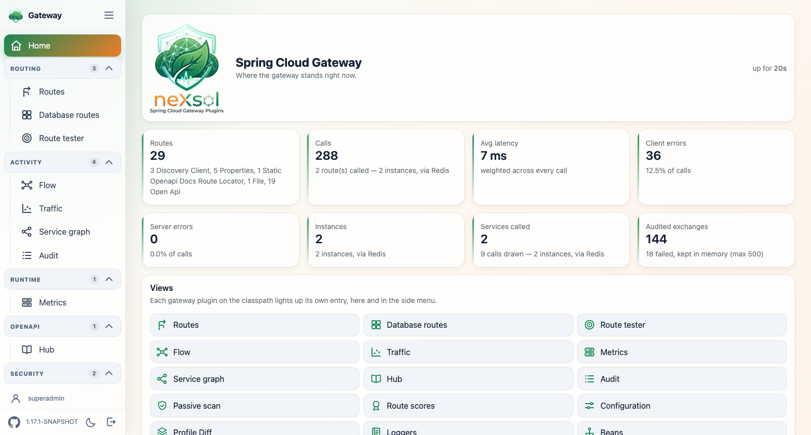

Every screenshot in this page comes from the
[gateway-full sample](../spring-cloud-gateway-samples/gateway/gateway-full), which runs
every plugin at once, so each view is shown with real routes and real traffic. Its console
signs an operator in, which is why the side menu carries a name and a way out &mdash; see
[Signing in](#signing-in). The two of the login page itself come from
[gateway-ui-secured](../spring-cloud-gateway-samples/gateway/gateway-ui-secured), the sample
that registers an identity provider. They are re-captured with
[tools/console-screenshots.mjs](../tools/README.md).

## The shell

* **Collapsible side menu** &mdash; the toggle button in the top-left corner switches the
  menu between the expanded state (icon + label) and the collapsed state (icon only). The
  choice is remembered across page loads.
* **Thin scrollbar** &mdash; the menu scrolls independently with a slim scrollbar.
* **Home page** &mdash; the overview of the gateway, rendered inside the shell.
* **Branding** &mdash; the mark sits at the top of the side menu and doubles as the favicon
  of every page, while the home page opens on the full lockup. Both are served from
  `static/img` (`icon.png`, `logo.png`, and `logo-dark.png` whose tagline is drawn for a
  dark page).
* **Light and dark theme** &mdash; the switch at the bottom of the menu flips the console
  between the two, starting from what the operating system reports and remembering the
  choice afterwards. It is applied before the page paints, so no page ever flashes light
  first. The traffic chart and the API reference pick their colours when they are created:
  their page reloads on a theme change rather than staying half-lit.
* **Version** &mdash; the version of the plugins, read from the manifest of the jar the UI
  ships in, sits next to the repository link. It is absent when the classes are not read
  from a jar, which is what running from an IDE does.
* **Remembered controls** &mdash; the switches and drop-downs of a view are restored as they
  were last left. Search boxes are not: a query kept across page loads would hide rows
  without the reader knowing why.

Collapsed, the menu keeps the icons and drops everything that carries text &mdash; the
brand, the entry labels and the version:

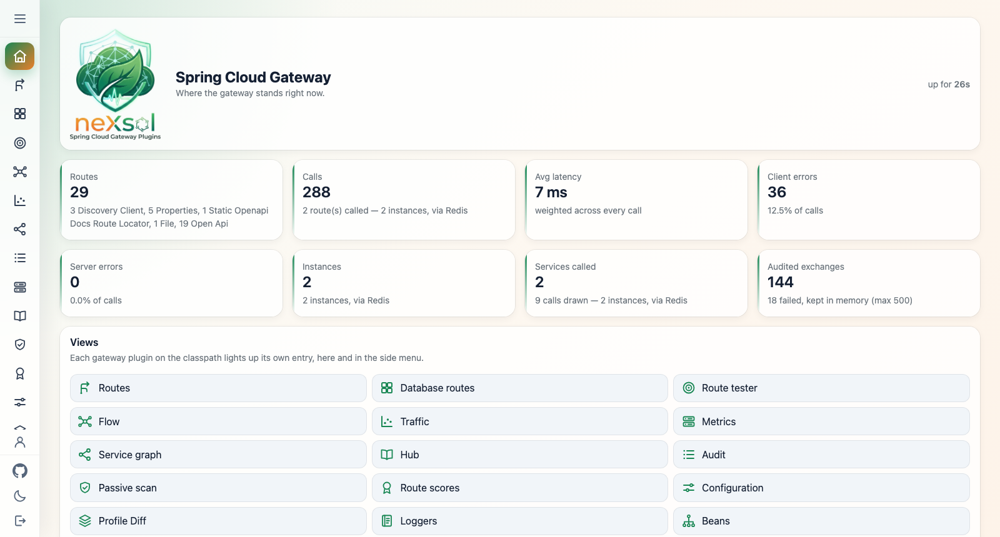

Built with Thymeleaf, Bootstrap, HTMX and plain CSS/JS, served as static resources (no
CDN, offline friendly).

Each view activates on its own, from what is on the classpath, so the UI only ever shows
what the application actually runs:

| View | Path | Activates when |
| --- | --- | --- |
| Home | `/ui` | always |
| Routes | `/ui/routes` | the gateway route definition types are present |
| Database routes | `/ui/routes/db` | `spring-cloud-gateway-routes-database` is present |
| Route tester | `/ui/routes/test` | the gateway route table type is present |
| Traffic | `/ui/metrics` | Micrometer is present |
| Instances | `/ui/metrics/instances` | Micrometer is present and `spring.cloud.gateway.server.webflux.metrics.instance.enabled` is not `false` |
| OpenAPI | `/ui/openapi` | `spring-cloud-gateway-hub-openapi` is present and `spring.cloud.gateway.server.webflux.hub-openapi.enabled` is `true` |
| Audit | `/ui/audit` | `spring-cloud-gateway-audit-core` is present and `spring.cloud.gateway.server.webflux.audit.enabled` is not `false` |

## Light and dark theme

The switch at the bottom of the side menu turns the whole console over, from the shell down
to the traffic chart and the API reference. The screenshots below are the light theme; here
is the same home page in both.

| Light | Dark |
| --- | --- |
|  | 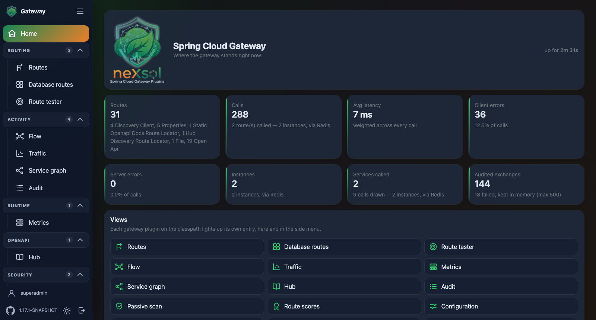 |

<details>
<summary>Every other view in the dark theme</summary>

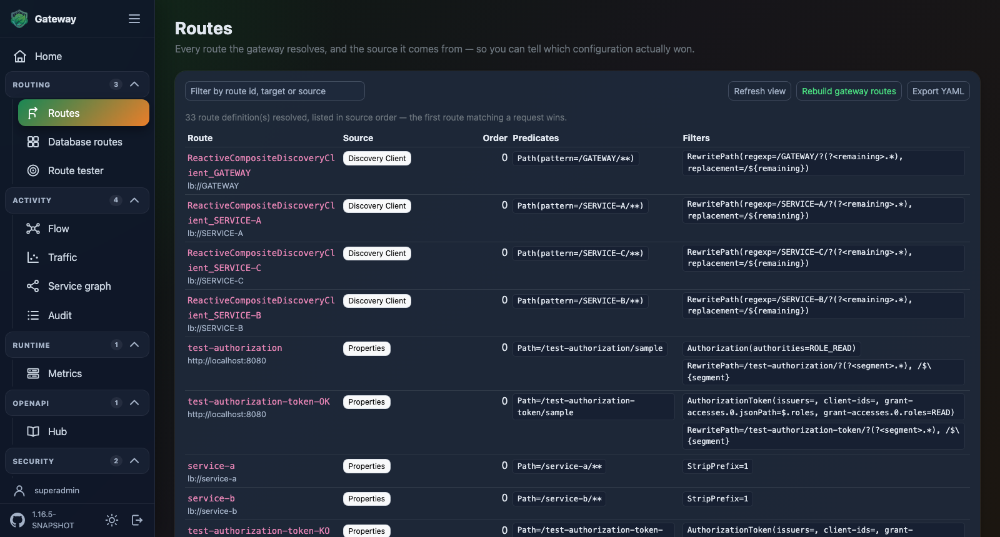
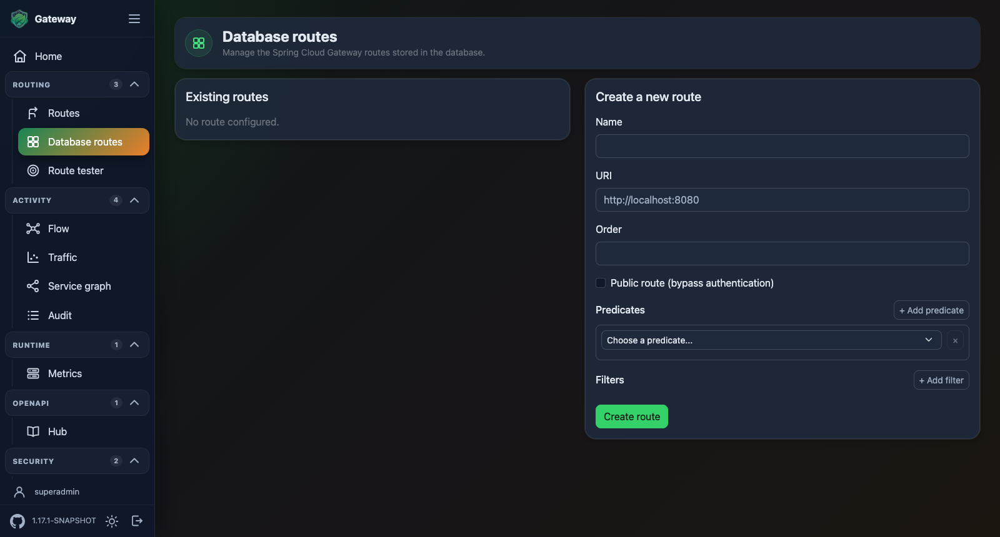
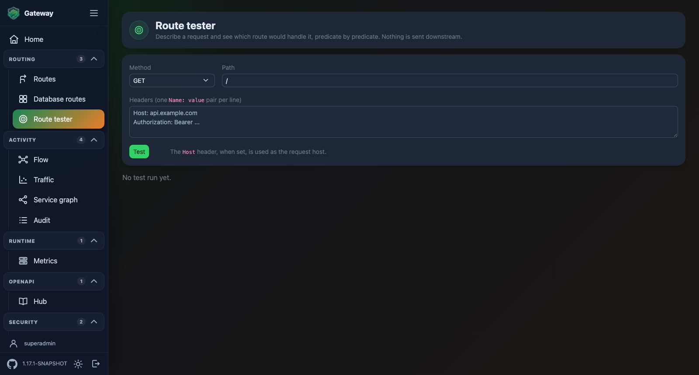
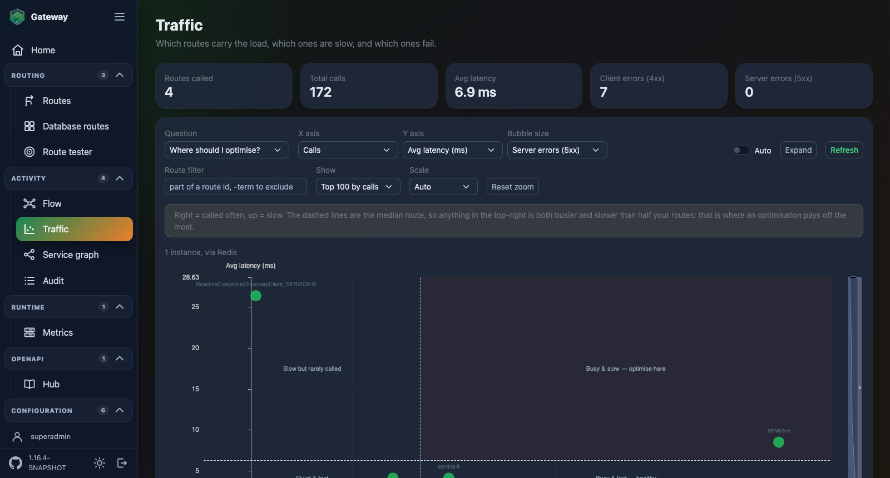
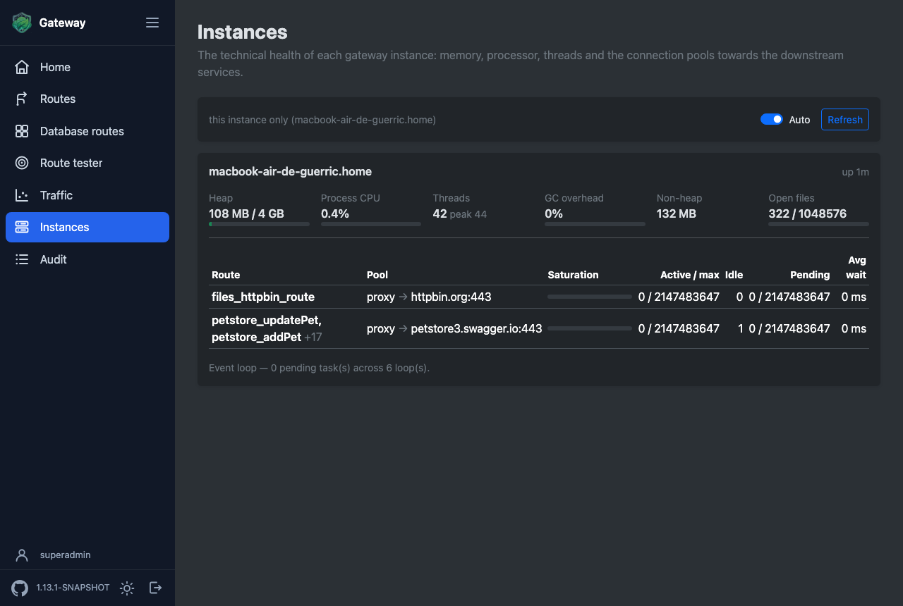
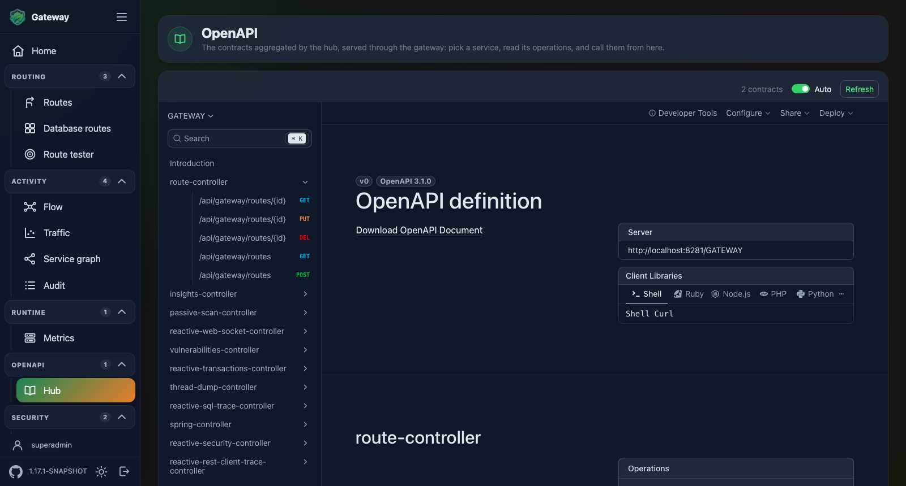
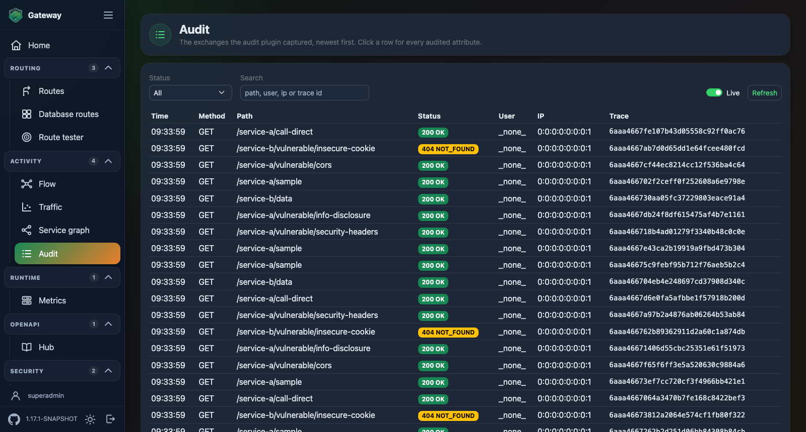

</details>

## Home page

An overview of the gateway rather than a welcome text: the uptime, one tile per figure
contributed by the active views (routes and their sources, calls, average latency, client
errors, server errors, audited exchanges) and a link to every view that lit up.

Client and server errors get a tile each, for the same reason the traffic view separates
them: a wave of 404 and a backend outage call for different actions.

The figures come from the views themselves: each one contributes an `OverviewContribution`
bean declared next to it and guarded by the same condition, so the home page never
references the optional types those views are built on. Any module can add a tile the same
way:

```java
@Bean
OverviewContribution quotaOverviewContribution(QuotaService quotaService) {
    // label, value (already formatted), one-line detail, sort weight
    return () -> Flux.just(new OverviewStat("Quota", quotaService.used() + "%", "of the monthly budget", 60));
}
```

A contribution that fails is dropped rather than failing the page.

## Routes view

Every route definition the gateway resolves, **attributed to the source it was read from**
&mdash; properties, database, YAML/JSON files, OpenAPI contracts, Config Server or any
third-party locator. This is what answers "which configuration actually won" when several
sources declare routes at once.

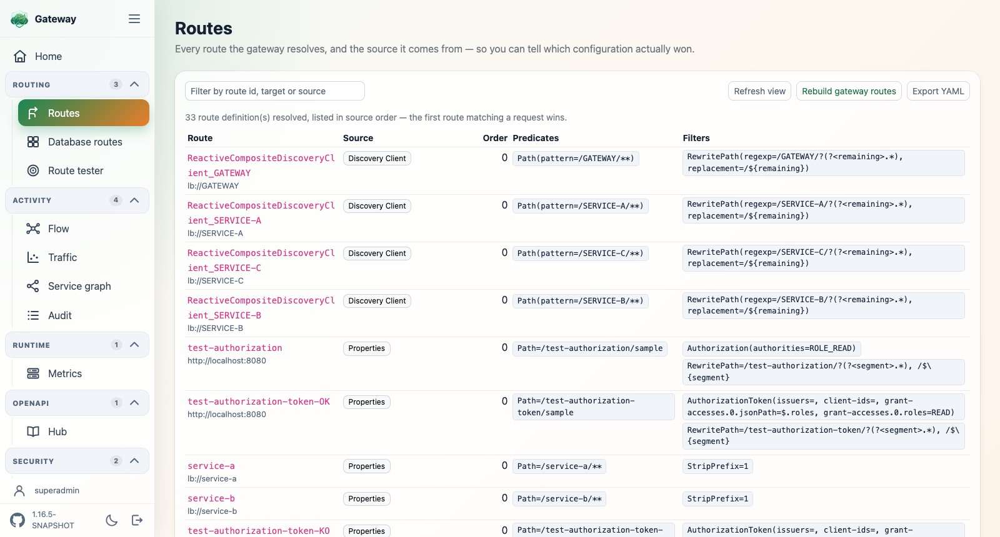

Each source is queried individually instead of through the gateway's aggregate, and the
source name is derived from the locator class name, so a locator contributed by any plugin
shows up correctly without this module knowing about it.

The inventory is **read once, then served while it is refreshed**. Only the very first
reader waits on the sources; a `RefreshRoutesEvent` marks the snapshot stale instead of
dropping it, and the read it triggers runs in the background. Navigating between this page
and the home page therefore queries nothing, and a locator that reaches the network &mdash;
service discovery, a remote contract &mdash; is never called in the middle of a page render.
This matters behind a discovery client: a refresh event arrives on every heartbeat, so a
snapshot dropped on each event would leave every view paying for a full read of a registry
holding hundreds of services. The page then shows the inventory as of the previous read; the
*Refresh view* action is what waits for a current one.

A refresh already in flight is shared rather than started again, so several views opened at
once cost one read. Each source is given five seconds to answer; past that it is dropped
from the snapshot with a warning, as a source that fails to be read is, so one unreachable
source cannot hold the page.

**Columns** &mdash; route (its id, with the target it resolves to under it), source, order,
predicates and filters. A predicate or filter is rendered the way it was declared, not as a
raw argument map: positional arguments read back as the YAML shortcut (`Path=/api/**`,
`StripPrefix=1`), named ones as a call (`Path(patterns=/api/**, matchTrailingSlash=true)`).

The table scrolls horizontally rather than squeezing: a rewrite filter carries a whole
regexp, and a target URI is shown on one line, cut with an ellipsis, with the full value in
its tooltip.

**Duplicate ids** &mdash; a route id declared by more than one source is badged. Both
definitions do reach the route table; the lowest order is matched first.

**Filter** &mdash; the search box narrows the table on route id, target or source.

**The two actions have different targets**, each named after what it refreshes:

| | Refresh view | Rebuild gateway routes |
| --- | --- | --- |
| Does | re-reads the sources, re-renders this table | publishes a `RefreshRoutesEvent`, then re-renders |
| Affects | this page only | the gateway route table used to route traffic |

*Refresh view* drops the cached inventory and calls every locator again. What that picks up
depends on the locator: a database or discovery source is queried live, while a file or
Config Server source serves the snapshot it last loaded &mdash; those reload through their
own plugin (a file watch, a poll, `/actuator/refresh`), never through this page.

*Rebuild gateway routes* aims at the gateway: `CachingRouteLocator` drops its cached `Route`
objects and rebuilds them from the current definitions, exactly as the gateway actuator
refresh endpoint does. This is what makes a definition change take effect on traffic &mdash;
though the routes-database plugin already publishes that event itself when a route is created
or deleted, so it is mostly for definitions changed behind the API's back (a row inserted
straight into the database, for instance).

## Route tester

Describe a request &mdash; method, path with an optional query string, headers, one
`Name: value` pair per line &mdash; and see which route would handle it. **Nothing is sent
downstream**: the request is never dispatched, only matched.

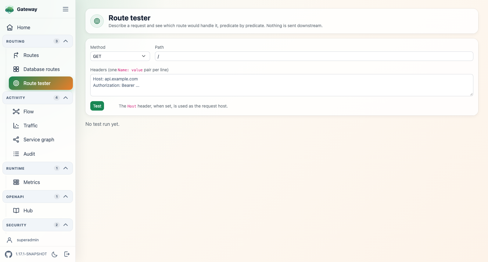

The verdict comes from the route table itself: the routes are read from the `RouteLocator`
and each one is evaluated with the very predicates the gateway would apply, in the very
order it applies them. The first match wins, as it does at runtime.

Each candidate is then broken down **predicate by predicate**, so a bare "no match" comes
with the reason:

```
✗ no match   alpha → http://alpha.example.com        Properties   order 0
   ✓ Paths: [/alpha/**], match trailing slash: true
   ✗ Methods: [POST]
```

The path matched, the method did not. The filters the winning route would apply are listed
under it.

A `Host` header, when given, is used as the request host, so host-based and multi-tenant
routing can be tested. The tested request carries no body, and a predicate reading something
only an in-flight call has (a response, a session) is reported as failed against that
predicate rather than failing the whole test.

## Audit view

The tail of the exchanges the audit plugin captured, newest first: time, method, path,
status (colour-coded by class), user, ip and trace id. A row expands into **every** attribute
the audit plugin collected for that exchange &mdash; JWT claims, headers, trace and span ids.

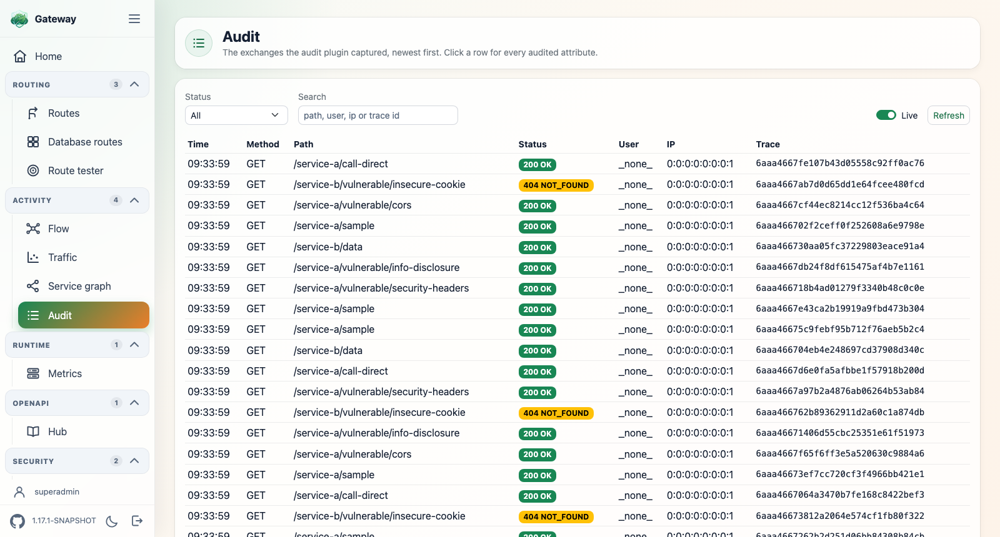

Filter by status class (2xx to 5xx) and search across method, path, user, ip and trace id.
The **Live** switch polls every 3 seconds.

The events are read on their way to the audit backend: the plugin's `AuditEventPublisher`
bean is wrapped in a decorator that keeps a copy, so the view works whichever backend is
configured &mdash; the default publisher, Redis, Kafka, a database or an
application-provided one.

The tail is a bounded in-memory buffer of at most 500 events, cleared on restart: it shows
the gateway's own recent traffic without querying the backend, which keeps the durable copy.
Auditing must be enabled on a route (the `Audit` gateway filter) or globally (the audit web
filter) for anything to show up.

The console keeps itself out of the trail. Its own paths &mdash; the pages, the HTMX
fragments they poll (`/ui/audit/events`, `/ui/metrics/data`) and the static assets
(`/js/echarts.min.js` and the rest) &mdash; are added to
`spring.cloud.gateway.server.webflux.audit.web-filter.exclude-paths`, so the global audit
web filter never records them: the view shows the traffic the gateway routed, not the
traffic of looking at it. The exclusions are the exact paths the active views declare
through `UiSecuredPaths`, never a `/ui/**` pattern, so a gateway route declared under `/ui`
keeps being audited. Add your own with the same property.

Setting `spring.cloud.gateway.server.webflux.audit.enabled=false` turns the audit plugin off,
and with it this view: the menu entry, the home page figure and the `/ui/audit` paths all
disappear, exactly as if the plugin were not on the classpath.

## Traffic view

When Micrometer is on the classpath, a **Traffic** entry appears (`/ui/metrics`), built
from the gateway request metrics (`spring.cloud.gateway.requests`): calls, average and max
latency, errors and error rate per route. The page reads top to bottom &mdash; summary,
then map, then the exact numbers.

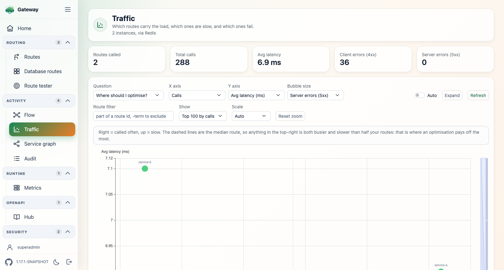

**Summary** &mdash; routes called, total calls, weighted average latency, total 4xx, total 5xx.

**4xx and 5xx are counted apart.** A 4xx is the caller being turned away (unknown path,
missing rights, malformed request); a 5xx is the gateway or the backend failing. Summing
them would make a scanner hitting unknown paths look like an outage, so each has its own
tile, its own column and its own axis. The bubble colour and the *Error rate* badge stay on
the 5xx: they answer "is it broken", not "is it being refused".

The **4xx** switch removes the client errors from the view entirely &mdash; tile, column,
axis options and the question built on them &mdash; for reading the traffic as pure
server-side health. A metric selection pointing at a hidden column falls back rather than
plotting what was just removed.

**Map** &mdash; one bubble per route (ECharts, vendored locally). The chart is driven by a
named question, which picks the metrics of both axes:

| Question | Reads as |
| --- | --- |
| Where should I optimise? | calls &times; avg latency &mdash; top-right is busier *and* slower than the median route |
| Where does it break? | calls &times; 5xx rate &mdash; top-right fails on traffic that matters |
| Who gets rejected? | calls &times; 4xx rate &mdash; top-right is refused on traffic that matters (wrong path, missing permission) |
| Which routes spike? | avg &times; max latency &mdash; outliers have a worst case far above their average |
| Custom&hellip; | re-opens the raw X / Y / bubble-size pickers |

Dashed lines mark the median of both axes and the four quadrants are labelled in place, so
a bubble's position is readable without a legend. Bubble colour is the error rate
(green &rarr; red), and each bubble is labelled with its route id. The **3D** switch adds a
third metric on a rotatable Z axis (echarts-gl); **Auto** polls every 5 seconds.

Each question also carries its Z axis, applied when the question is picked: *Who gets
rejected?* plots the client errors, the others the server errors. It is only a starting
point &mdash; changing Z afterwards sticks until another question is selected.

**All routes** &mdash; the same data as a sortable table (click any column) for the exact
figures, with the error rate as a colour-coded badge.

The view is fed by `GET /ui/metrics/data` (JSON). It stays hidden when no meter registry is
available, and shows an empty state until traffic has flowed through the gateway (gateway
request metrics are enabled by default).

### Excluding routes

Some routes carry no traffic worth reading &mdash; the documentation routes the OpenAPI hub
publishes are contracts being fetched, not usage. They are left out by default:

```yaml
spring.cloud.gateway.server.webflux.metrics:
  excluded-routes:
    - openapi-docs-.*            # the default
```

Each entry is a regular expression matched against the **route id**, and the whole id must
match (`docs` excludes `docs`, not `docs-public`). Setting the property replaces the default
list, so keep `openapi-docs-.*` if you want to keep hiding them:

```yaml
spring.cloud.gateway.server.webflux.metrics:
  excluded-routes:
    - openapi-docs-.*
    - internal_.*
    - .*_healthcheck
```

An empty list shows every route. A malformed expression is dropped with a warning and the
application still starts.

The exclusion applies to the whole view: the summary, the map, the table and the traffic
figures on the home page all read the same filtered set.

## Instances view

The other half of the metrics plugin: not which route carries the load, but **which
instance is in trouble**. One card per running gateway, read from the same provider as the
traffic view and headed by the same coverage line.

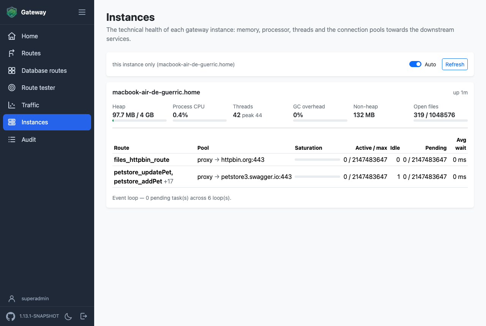

Each card carries the JVM figures &mdash; heap against its ceiling, process CPU, live and
peak threads, garbage collection overhead, non-heap, open file descriptors &mdash; and then
the part no per-route figure can show:

```
gateway-7f9c4   http://10.0.3.21:8080                          up 4d 02h
Heap ▓▓▓▓▓▓▓░░░ 71%  1.4 / 2.0 GB   CPU 34%   Threads 87 (peak 112)   GC 0.4%

Pools
  Route                             Pool
  service-a-route                   proxy → 323d64b065a5:8080   ▓▓▓▓▓▓▓▓▓░   47 / 50   340 ms
  petstore_updatePet, …addPet +17   proxy → c2b76b2d36a1:8443   ▓░░░░░░░░░    2 / 50     0 ms
Event loop — 0 pending task(s) across 8 loop(s).
```

**The connection pools are why this view exists.** A pool filling up towards a slow
backend takes down every route pointing at that address at once, while the JVM itself
still looks perfectly healthy: nothing in the traffic view separates that from the backend
being slow, and nothing in a generic JVM dashboard shows it at all. The rows are sorted
fullest first, and folded per connection provider and downstream address rather than per
internal pool instance.

**The route column** turns that address into something a reader knows. Behind Docker
Swarm or Kubernetes a pool is keyed on a container identity (`323d64b065a5:8080`), which
names nothing on its own, so `PoolRouteResolver` maps it back two ways: a route with a
literal URI carries its own authority and is matched straight from the route table &mdash;
the default port of the scheme filled in, since a route often leaves it out and a pool
never does &mdash; while a load-balanced route (`lb://SERVICE-X`) only resolves through
the service registry, which is read for the addresses the route table could not name, and
only for those. An address neither knows &mdash; an instance deregistered while its
connections still live &mdash; keeps a dash rather than being attributed to a route it may
not serve. Without a registry in the context, literal routes are still named.

A downstream is often the target of several routes &mdash; a pool serves the service, not
the route, and an OpenAPI contract turned into one route per operation alone puts twenty of
them on one address. All of them travel in the payload; the cell spells out two and counts
the rest, so the column stays a column.

The event loop line is the WebFlux-specific counterpart: pending tasks are what says
something is blocking the loop, which slows every route down for a reason no route-level
figure explains.

Both sections depend on instrumentation the gateway leaves off. When it is off the view
says so, per instance, and names the property to set &mdash; an empty pool table would
otherwise read as "no downstream called yet", which calls for waiting rather than for a
configuration change. See
[spring-cloud-gateway-metrics](../spring-cloud-gateway-metrics/README.md#instrumentation).

A figure the JVM does not publish &mdash; open file descriptors outside Unix, a heap with
no ceiling &mdash; is shown as a dash rather than as a zero.

Plain markup and CSS, no charting library: these are bars, and the page already costs a
poll. The auto-refresh switch is remembered across page loads like every other control of
the shell.

## Menu entries (Spring Boot Admin style)

Menu entries come from a registry: any `NavItem` bean present in the application context
is collected by `GatewayUiMenu` and rendered in the sidebar.

The built-in `home` entry is always present. A `routes` entry is contributed by this
plugin but activates &mdash; only when the routes-database API is on the classpath &mdash;
through a conditionally-guarded bean:

```java
@Bean
@ConditionalOnClass(name = "ch.nexsol.gateway.database.controller.RouteViewController")
NavItem routesNavItem() {
    // id, label, icon (SVG symbol id from the shell sprite), href, order
    return new NavItem("routes", "Database routes", "icon-plugin", "/ui/routes/db", 10);
}
```

Any module can light up its own entry the same way, simply by declaring a `NavItem` bean
(optionally guarded by a condition). Icons reference the SVG sprite declared in
`templates/dashboard/fragments/layout.html` (`icon-home`, `icon-plugin`, `icon-route`,
`icon-target`, `icon-chart`, `icon-book`, `icon-list`).

The built-in entries are ordered `home` (0), `Routes` (5), `Database routes` (10),
`Route tester` (15), `Traffic` (20), `OpenAPI` (25) and `Audit` (30), leaving room for your
own in between.

## Hosting a plugin page inside the shell

A plugin renders its own page inside the shell by targeting the layout fragment and
supplying a content and a scripts slot:

```html
<html th:replace="~{dashboard/fragments/layout :: layout('Title', ~{:: #content}, ~{:: #scripts})}">
<body>
    <div id="content"> ... page markup ... </div>
    <script id="scripts"> ... page JS (Bootstrap/HTMX already loaded) ... </script>
</body>
</html>
```

The sidebar is populated automatically for every rendered view by `GatewayUiModelAttributes`
(a `@ControllerAdvice` exposing `navItems`); the controller only sets `activeNav` to its
own entry id. The database routes management page (`spring-cloud-gateway-routes-database`)
is wired exactly this way and shows up under `/ui/routes/db`.

## OpenAPI view

When [spring-cloud-gateway-hub-openapi](../spring-cloud-gateway-hub-openapi/README.md) is on
the classpath **and** enabled, the shell lights up an `OpenAPI` entry serving the contracts
the hub aggregates, rendered with [Scalar](https://github.com/scalar/scalar) at `/ui/openapi`.

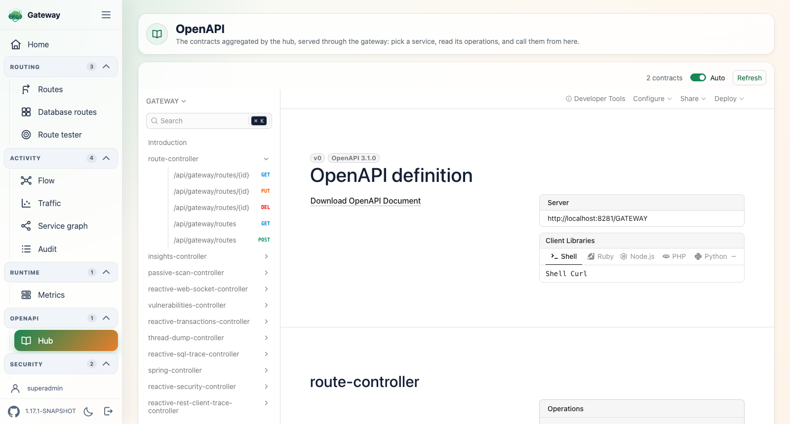

The page reads the list of contracts from the SpringDoc `swagger-config` endpoint, which the
hub keeps in sync with the discovered services, and feeds them to Scalar as its document
sources: one entry per service in the selector. Since the hub rewrites each contract's
`servers` section to the gateway, Scalar's request client calls the gateway, not the service
directly. When nothing has been aggregated, the contract of the gateway itself is shown.

A custom `springdoc.api-docs.path` is honoured &mdash; the view is handed the configured
paths, it does not assume `/v3/api-docs`.

**Vendor extensions** &mdash; Scalar renders the extensions it knows about (`x-internal`,
`x-displayName`, `x-badges`, `x-codeSamples`, `x-tagGroups`, the `x-enum*` family, `x-example`,
`x-scalar-*`) and drops the others, so what a service documents of its own &mdash; the roles a
resource requires, the version it appeared in &mdash; would not be displayed. A Scalar plugin
renders those, from the mapping declared below. The contracts themselves are handed to Scalar
by URL: it fetches only the one on screen and parses it, YAML included.

Each extension is declared with the label it reads under, and the plugin registry matches an
extension by its exact name:

```yaml
spring.cloud.gateway.server.webflux.ui.openapi:
  extensions:
    x-roles: Required roles
    x-from-application-version: Since
```

An operation carrying `x-roles` then reads `Required roles — admin, auditor`, a list shown
comma-separated and an object as JSON. An extension left out of the mapping is not shown, and
adding one takes a restart, not a rebuild.

Scalar renders extensions on the document, on `info`, on a tag, on a schema and on an
operation. A path item is not one of its rendering points, so an extension declared there
does not reach the operations under it. `x-badges` is rendered natively, as a badge next to
the operation, which suits a short label better than this mapping does.

The Scalar bundle ships with the plugin (`/js/scalar.standalone.js`, `@scalar/api-reference`
1.63.0, 3.6 MB) and its default web fonts are switched off, so the view works on an isolated
network without reaching any CDN.

## Spring Security

When Spring Security is on the classpath, the plugin contributes its own
`SecurityWebFilterChain` so the shell keeps working behind the authentication of the
application. Nothing has to be declared.

What that chain does with the paths of the console is the **mode**. It permits them by
default, which is the behaviour the plugin has always had. Set to `authenticated`, it puts
a login page in front of them instead &mdash; see [Signing in](#signing-in) below.

The chain permits **exactly** the paths the active views serve &mdash; never a `/ui/**`
pattern. A gateway route declared under `/ui` (say `/ui/find_pwd`) must not inherit the UI
permissions, and a view that is not active leaves its path closed. Each view declares its
own endpoints and assets through a `UiSecuredPaths` bean:

```java
@Bean
UiSecuredPaths auditTailSecuredPaths() {
    return new UiSecuredPaths("/ui/audit", "/ui/audit/events", "/js/gateway-audit.js");
}
```

A plugin hosting its own page inside the shell declares its paths the same way, and they
join the chain.

What is permitted out of the box: `/ui` and the shell assets, plus `/ui/routes`,
`/ui/routes/list`, `/ui/routes/reload`, `/ui/routes/test`, `/ui/metrics`,
`/ui/metrics/data`, `/ui/audit`, `/ui/audit/events`, `/ui/openapi` and their assets for the
views that are active. The contracts the OpenAPI view reads are permitted by the hub's own
chain, not by this one. The database routes management page (`/ui/routes/db`, which creates and deletes
routes) is **not** permitted: it belongs to another plugin and stays under the rules of the
application.

The chain is ordered at `GatewayUiSecurityAutoConfiguration.GATEWAY_UI_CHAIN_ORDER`
(`Ordered.HIGHEST_PRECEDENCE + 300`), ahead of the chains an application usually declares
from `@Order(1)`. Two escape hatches: declare your own bean named
`gatewayUiSecurityWebFilterChain` (the plugin backs off), or turn it off:

```yaml
spring.cloud.gateway.server.webflux:
  ui:
    security-chain-enabled: false
```

> As with any `SecurityWebFilterChain` bean, its presence makes Spring Boot back off from
> its default "everything authenticated" chain. An application that was relying on that
> default must declare its own chains.

The chain is built from a `ServerHttpSecurity`, which only exists once WebFlux security is
enabled. In practice that means `spring-boot-starter-security`: with the raw Spring Security
jars alone and no Boot security auto-configuration, the plugin contributes nothing and the
console stays under the rules of the application.

## Signing in

The console can carry its own login page rather than borrowing the authentication of the
application. One property switches it on:

```yaml
spring.cloud.gateway.server.webflux:
  ui:
    security:
      mode: authenticated
      user:
        name: superadmin
        password: ${ADMIN_PASSWORD}
```

Every path the active views serve is then behind an authenticated principal; the login page
and the static assets it paints with are the only ones left open.

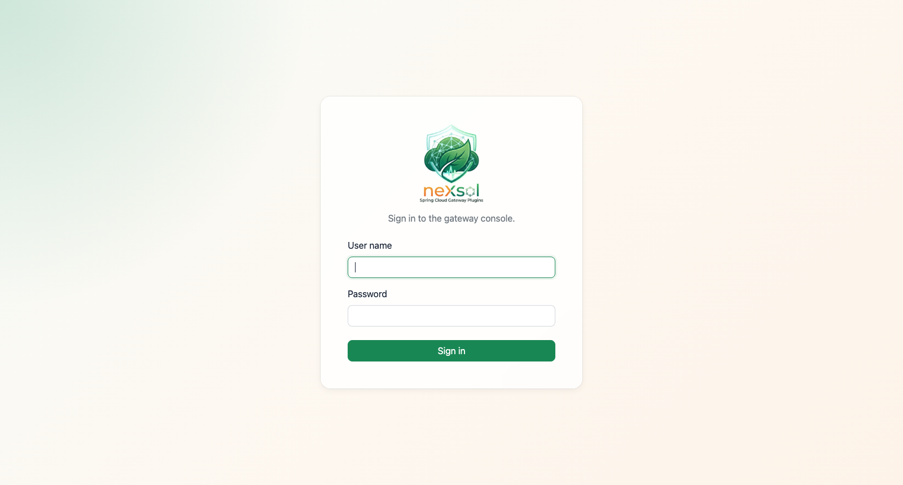

> The two screenshots of this section come from the
> [gateway-ui-secured sample](../spring-cloud-gateway-samples/gateway/gateway-ui-secured/README.md),
> which is this whole section running: a local user, a Keycloak the sample starts and
> imports a realm into, and a Bearer token on the endpoints. The provider button is there
> because that sample registers one; with a local user alone the form stands on its own.

It follows the console into the dark theme, remembering the choice made in the side menu so
signing back in never flashes the other one:

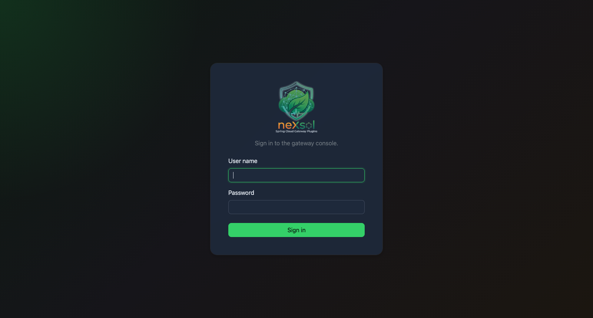

What that gives you:

* **A local user** &mdash; declared by the properties above and held by this chain alone.
  It is *not* registered as a `ReactiveUserDetailsService`, so it neither competes with nor
  replaces the authentication the rest of the application is built on. The password is taken
  as-is when it carries the id of the encoder that produced it (`{bcrypt}$2a$…`) and
  encoded at start-up otherwise. Leave it unset and the console authenticates against
  whatever directory the application declared.
* **An OpenID Connect provider** &mdash; nothing to configure beyond the standard Spring
  Security client registration. A button per registered provider appears on the login page
  on its own:

  ```yaml
  spring.security.oauth2.client:
    registration.oidc:
      client-id: gateway-console
      client-secret: ${OIDC_CLIENT_SECRET}
      scope: openid,profile,email
    provider.oidc:
      issuer-uri: https://your-idp.example.com/realms/master
  ```

  Both ways in can be offered at once, which is the point: operators sign in through the
  provider, and the local user stays as the way in when the provider is unreachable. With a
  provider alone and no local user, the credentials form is left out rather than shown
  unable to succeed.
* **A Bearer token** &mdash; name an issuer and the endpoints of the console answer a token
  as well as a session, for a script or an external dashboard reading `/ui/metrics/data` and
  the like:

  ```yaml
  spring.cloud.gateway.server.webflux.ui.security:
    oauth2:
      resourceserver:
        jwt:
          issuer-uri: https://your-idp.example.com/realms/master
  ```

  This is deliberately *not* `spring.security.oauth2.resourceserver`. That property holds a
  single issuer for the whole application, and on a gateway it belongs to the traffic being
  routed: a gateway validating the tokens of its microservices against one authorization
  server can this way have its console answer to another. Setting the Spring property
  instead would replace the issuer the routes depend on.

  Left unset, the console falls back on whatever `ReactiveJwtDecoder` the application
  already declared &mdash; convenient when both answer to the same issuer. Two consequences
  worth knowing when leaning on that fallback: an application configuring **only** the
  multi-tenant issuers of the [oauth2 plugin](../spring-cloud-gateway-oauth2/README.md)
  declares no decoder at all, so the console quietly serves sessions alone; and the fallback
  is a decoder, not a tenant resolver, so it answers to one issuer even where the routed
  traffic answers to several.

  The issuer is asked for its keys on the first token that arrives, never at start-up: a
  gateway comes up whether or not the provider is answering.

* **Roles** &mdash; `required-roles` narrows the console to the principals holding them, and
  `roles-claim` says where the token carries its roles, as a dotted path into the claim set
  (`roles`, `realm_access.roles`, `resource_access.console.roles`&hellip;). The roles read
  there are added to the authorities of a Bearer token and of an OIDC session alike, so the
  same rule applies to both:

  ```yaml
  spring.cloud.gateway.server.webflux.ui.security:
    roles-claim: realm_access.roles
    required-roles: [ADMIN]
  ```

  Left empty, any authenticated principal is let through. A principal signed in but holding
  none of them is not answered with a bare `403`: signing in again would hand back the same
  roles, so the console shows them a page saying so, carrying the button that ends the
  session.

  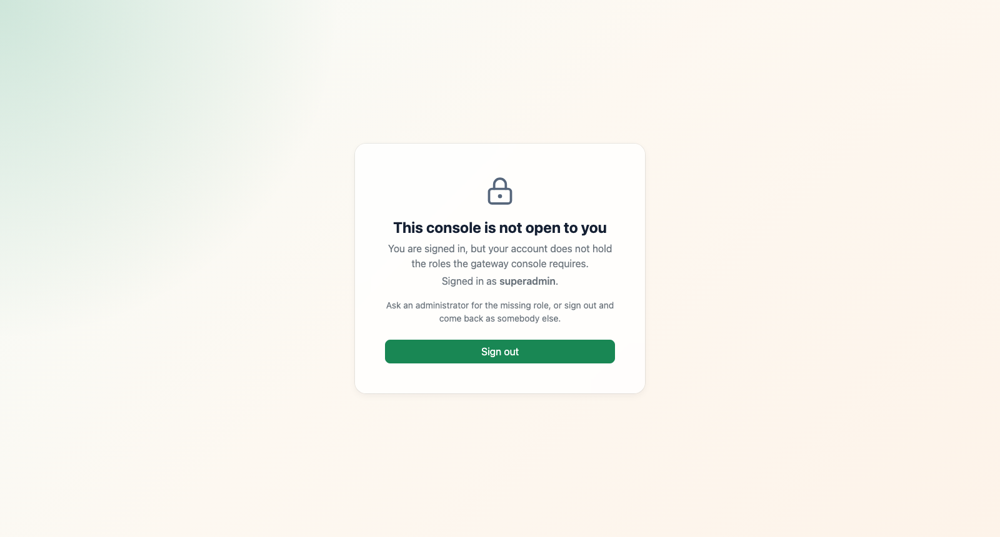

  `/ui/forbidden` and `/ui/logout` are therefore behind *authentication* and never behind
  `required-roles`: gating them on the roles would trap someone who holds none, unable even
  to sign out.

  What names the principal is `user-name-attribute` on the provider. Keycloak issues an
  opaque `sub` by default, so point it at something a person recognises, or the side menu
  reads a UUID:

  ```yaml
  spring.security.oauth2.client.provider.keycloak.user-name-attribute: preferred_username
  ```

| Property | Default | What it does |
| --- | --- | --- |
| `...ui.security.mode` | `permit-all` | `authenticated` puts the login page in front of the console |
| `...ui.security.user.name` | `admin` | Name of the local user |
| `...ui.security.user.password` | &mdash; | Password of the local user; unset, no local user is declared |
| `...ui.security.user.roles` | `[ADMIN]` | Roles the local user holds |
| `...ui.security.roles-claim` | &mdash; | Dotted path the roles of a token are read from |
| `...ui.security.required-roles` | `[]` | Roles a principal must hold; empty lets any authenticated principal through |

Signing in resumes the navigation it interrupted: the page the visitor was heading for is
saved and served once the session opens, falling back on `/ui`. The side menu then shows who
is signed in, with the button that ends the session next to the theme switch.

Signing out ends the session the **provider** holds as well, through its
`end_session_endpoint`. Without that, the console would close its own session and the
provider would hand the same account straight back on the next sign-in: nobody could come
back as somebody else without clearing their cookies. Two things follow from it:

* The provider must accept the console as a post-logout destination. In Keycloak that is
  the client's *Valid post logout redirect URIs*, and it has to cover
  `<gateway>/ui/login?logout`.
* This is a single sign-on session, so an operator signing out of the console signs out of
  whatever else shares it.

A local user, or a provider publishing no `end_session_endpoint`, is signed out the ordinary
way &mdash; the console falls back on its own login page.

Answers are given in the terms of the request that was made, which is what keeps the shell
usable rather than merely secured:

| Request | Unauthenticated answer |
| --- | --- |
| A page navigation | `302` to `/ui/login` |
| An HTMX fragment | `401` carrying `HX-Redirect: /ui/login`, so HTMX reloads the page instead of swapping the login form into a corner of the shell |
| An event stream (`/ui/audit/events`) | `401`, which an `EventSource` can act on &mdash; served the login page, it would keep reconnecting to it |
| A request carrying `Authorization` | `401` with `WWW-Authenticate: Bearer` rather than an HTML page |

CSRF protection is on in this mode, since the console is then behind a session cookie. The
forms carry the token as a hidden field, and `gateway-ui.js` puts it on every HTMX request
from the `<meta name="_csrf">` tags the shell renders. A plugin hosting its own page inside
the shell gets this for free as long as it goes through the shell layout.

The [gateway-ui-secured sample](../spring-cloud-gateway-samples/gateway/gateway-ui-secured/README.md)
runs all of it &mdash; local user, Keycloak with an imported realm, roles, Bearer tokens
&mdash; and declares no security bean of its own.
